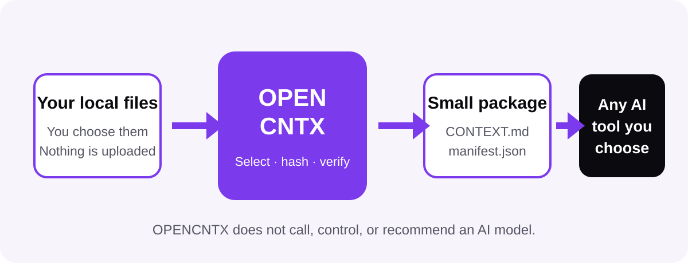

# OPENCNTX

<picture>
  <source media="(prefers-color-scheme: dark)" srcset="assets/brand/opencntx-wordmark-dark.svg">
  
</picture>

**Small context. Clear evidence. Any model.**

OPENCNTX is a small local command-line tool that turns the files you choose
into a reviewable context package for one AI task. It records paths, sizes, and
SHA-256 hashes so you can see exactly what was included and detect later
changes.

It works without an account, API key, cloud service, or built-in AI model. You
can use the resulting text files with any AI tool that accepts text or file
input. OPENCNTX does not call, control, or recommend that tool.



## Who is it for?

- **New AI users:** follow a short, safe path and inspect the package before
  sharing it.
- **Experienced users:** control file patterns, byte budgets, hashes, task
  inputs, and reproducible verification.
- **Project owners:** keep goals, approvals, sources, chapters, tasks, and
  results in a clear local workspace.
- **Any model or provider:** the output is ordinary reviewable text, not a
  provider-specific format.

## Install the stable release

OPENCNTX requires Python 3.11 or newer. The current public release is `v0.2.0`.

```powershell
git clone --branch v0.2.0 --depth 1 https://github.com/CNTX-PROJECT/OPENCNTX.git
cd OPENCNTX
python -m pip install .
opencntx --help
```

For contributor work on the current source:

```powershell
git clone --depth 1 https://github.com/CNTX-PROJECT/OPENCNTX.git
cd OPENCNTX
python -m pip install .
```

See [Installation](docs/installation.md) for Windows, Ubuntu, verification,
upgrading, and removal.

## Create your first context package

Run these commands inside the project that contains the files you want to use:

```powershell
opencntx init
opencntx pack
opencntx verify .opencntx/latest
```

`init` creates a readable `opencntx.toml`. Edit its goal and allowed file
patterns before running `pack`. Then read `.opencntx/latest/CONTEXT.md`
yourself. Share it only when its contents are correct for your task.


Follow the complete beginner path in [Getting started](docs/getting-started.md).

## Optional project workspace

The workspace layer stores supplied files byte-for-byte and organizes them as
sources, chapters, tasks, playbooks, roles, and bounded executor packages.

```powershell
opencntx workspace init my-project
opencntx workspace control refresh --root my-project
opencntx workspace capture README.md --root my-project --origin OWNER
```

It can build a small task-bound context package, but it never starts an AI,
agent, shell process, OCR tool, transcription service, or external sync.

## Choose the page you need

| Goal | Start here |
|---|---|
| Install OPENCNTX | [Installation](docs/installation.md) |
| Make a first package | [Getting started](docs/getting-started.md) |
| Understand the product | [How it works](docs/how-it-works.md) |
| Learn `init`, `pack`, and `verify` | [Core commands](docs/core.md) |
| Understand package files and drift | [Context packages](docs/context-packets.md) |
| Create a project workspace | [Workspace](docs/workspace.md) |
| Organize knowledge | [Chapters and catalog](docs/chapters-and-catalog.md) |
| Build small task context | [Context navigation](docs/context-navigation.md) |
| Register derived text safely | [Media and derived text](docs/media.md) |
| Define bounded execution | [Playbooks and roles](docs/playbooks-and-roles.md) |
| Use approval gates | [OWNER flow](docs/owner-flow.md) |
| Find an exact CLI path | [Command reference](docs/commands.md) |
| Understand the safety boundary | [Security](docs/security.md) |
| See tested platforms and CI | [Platforms](docs/platforms.md) |
| See completed milestones | [Public roadmap](docs/roadmap.md) |
| Fix a common problem | [Troubleshooting](docs/troubleshooting.md) |
| Read common answers | [FAQ](docs/faq.md) |
| Look up a term | [Glossary](docs/glossary.md) |
| Use the visual identity | [Brand guide](docs/brand.md) |

The [documentation home](docs/README.md) offers short reading paths for new
users, workspace users, project owners, and technical reviewers.

## Safety in one minute

- OPENCNTX reads only selected local UTF-8 text inside the project boundary.
- Sensitive patterns such as `.env*`, `**/*.key`, and `**/*.pem` are excluded
  by default, but you must still inspect the output.
- A hash detects changed bytes. It does not prove that content is true, safe,
  complete, or approved.
- Privacy labels classify content. They do not encrypt it or control access.
- A non-zero exit code means the requested operation was not fully proven.
- OPENCNTX never uploads a package. Sharing is always your separate action.

Read the canonical [Security Policy](SECURITY.md) before handling sensitive
material. Report vulnerabilities privately through GitHub's **Report a
vulnerability** route, never in a public issue.

## Current status

- Current release: [`v0.2.0`](https://github.com/CNTX-PROJECT/OPENCNTX/releases/tag/v0.2.0)
- Package version: `0.2.0`
- Python: 3.11, 3.12, and 3.13
- CI status label: `CI_ACTIVE`
- CI matrix: Windows and Ubuntu across all three supported Python versions
- Runtime dependencies: none
- License: [Apache-2.0](LICENSE)

Only a live CI run on the exact commit proves that its six matrix jobs passed.
See the [changelog](CHANGELOG.md), [support routes](SUPPORT.md), and
[contribution guide](CONTRIBUTING.md) for the next step.
