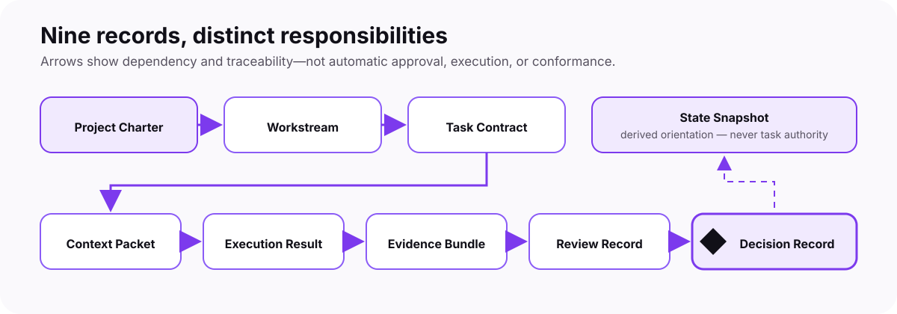

  <picture>
    <source media="(prefers-color-scheme: dark)" srcset="docs/assets/brand/cntx-logo-dark.svg">
    <source media="(prefers-color-scheme: light)" srcset="docs/assets/brand/cntx-logo-light.svg">
    
  </picture>

<strong>Give AI clear context. Keep evidence. Let people decide.</strong>

  <a href="README.md"><strong>Overview</strong></a> ·
  <a href="ROADMAP.md">Roadmap</a> ·
  <a href="docs/architecture/README.md">Architecture</a> ·
  <a href="docs/contracts/README.md">Contracts</a> ·
  <a href="schemas/README.md">Schemas</a> ·
  <a href="docs/brand/README.md">Brand</a> ·
  <a href="CONTRIBUTING.md">Contribute</a>

  <picture>
    <source media="(prefers-color-scheme: dark)" srcset="docs/assets/brand/cntx-status-dark.svg">
    <source media="(prefers-color-scheme: light)" srcset="docs/assets/brand/cntx-status-light.svg">
    
  </picture>

<picture>
  <source media="(prefers-color-scheme: dark)" srcset="docs/assets/brand/cntx-collaboration-dark.png">
  <source media="(prefers-color-scheme: light)" srcset="docs/assets/brand/cntx-collaboration-light.png">
  
</picture>

## CNTX in one minute

AI can forget instructions, mix contexts, invent missing details, or act with
more authority than it was given. CNTX is an open specification for making that
work easier to inspect and control.

| The problem | The CNTX approach | The intended result |
| --- | --- | --- |
| Context becomes unclear or too large | Give each task a small, explicit context | Less context mixing and easier review |
| AI output can sound certain without proof | Keep claims, evidence, uncertainty, and review separate | Unsupported conclusions stay visible |
| Automation can blur who approved what | Keep final consequential authority with identified people | No automatic self-approval |

CNTX does not promise perfect AI. It provides a shared structure for bounded,
traceable collaboration between one or more people and specialized AI agents.
It remains independent of any model, vendor, runtime, product, or domain.

## One controlled path

<picture>
  <source media="(prefers-color-scheme: dark)" srcset="docs/assets/brand/cntx-how-it-works-dark.svg">
  <source media="(prefers-color-scheme: light)" srcset="docs/assets/brand/cntx-how-it-works-light.svg">
  
</picture>

Every step stays separate. Work does not become evidence by itself. Evidence
does not become approval by itself. A tool or AI agent does not become final
authority by producing a result.

## What CNTX records

Nine record types preserve the path from project intent to a reviewed human
decision. They can be read as documents today; their structure is also defined
by versioned JSON Schemas.

<picture>
  <source media="(prefers-color-scheme: dark)" srcset="docs/assets/brand/cntx-artifact-chain-dark.svg">
  <source media="(prefers-color-scheme: light)" srcset="docs/assets/brand/cntx-artifact-chain-light.svg">
  
</picture>

## What exists today

| Part | Public baseline |
| --- | --- |
| Design | 33 Accepted architecture decisions with matching ADRs |
| Collaboration records | 9 Accepted artifact contracts |
| Machine-readable structure | 10 Accepted JSON Schema Draft 2020-12 resources at version `1.0.0` |
| Examples and tests | 203 synthetic cases: 38 valid and 165 invalid |
| Extension model | Accepted conceptual boundaries through ARCH-033 |
| Public release | Immutable, unsupported prerelease `0.1.0-prealpha.1` |

> [!IMPORTANT]
> CNTX is currently a specification foundation, not a finished software
> product. It does not yet provide a concrete validator, runner, SDK, API, CLI,
> workflow, runtime, hosted service, supported release line, certification, or
> deployment. Schema validity alone does not prove truth, approval, security,
> conformance, or final authority.

## Roadmap pulse

<picture>
  <source media="(prefers-color-scheme: dark)" srcset="docs/assets/brand/cntx-roadmap-dark.svg">
  <source media="(prefers-color-scheme: light)" srcset="docs/assets/brand/cntx-roadmap-light.svg">
  
</picture>

The proposed next milestone is a small offline validation and integrity slice:
run the existing schemas and 203 cases reproducibly, then test cross-record
links and one real bounded task. It creates no implementation authority by
itself. CNTX uses governed gates rather than a promised completion date.

See the [full roadmap and public baseline history](ROADMAP.md).

## Start here

| If you want to… | Open… |
| --- | --- |
| Understand the idea | [Architecture index](docs/architecture/README.md) |
| See the nine records | [Artifact contracts](docs/contracts/README.md) |
| Inspect machine-readable rules | [JSON Schemas](schemas/README.md) |
| Inspect positive and negative examples | [Schema test cases](tests/schemas/) |
| Follow progress and future gates | [Roadmap](ROADMAP.md) |
| Check the public release | [Release index](docs/release/README.md) |
| Propose a safe change | [Contributing](CONTRIBUTING.md) and [Governance](GOVERNANCE.md) |
| Report a vulnerability | [Security](SECURITY.md) |

## Find CNTX

`AI collaboration` · `context engineering` · `bounded context` ·
`human-in-the-loop` · `evidence` · `AI governance` · `JSON Schema` ·
`multi-agent systems` · `vendor-neutral specification`

## Public boundary

Never place private project data, secrets, credentials, personal data,
production configuration, or production automation in this public repository.
Read [Security](SECURITY.md), [Governance](GOVERNANCE.md), and
[AGENTS.md](AGENTS.md) before contributing consequential work.

---

  Apache-2.0 licensed · Public by design · Human authority preserved

