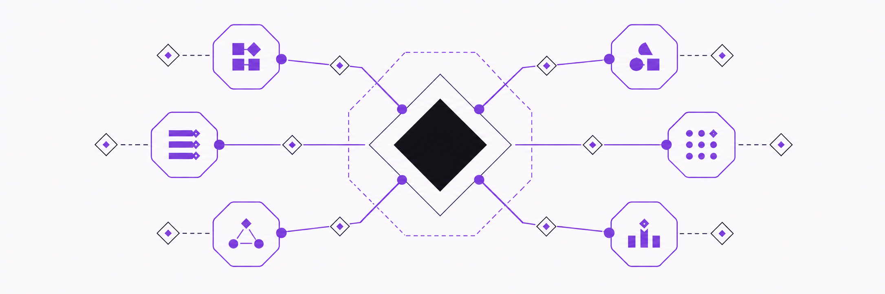
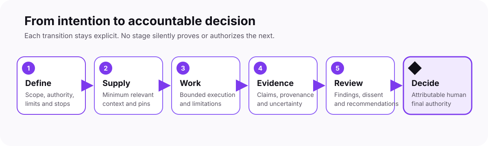

  <picture>
    <source media="(prefers-color-scheme: dark)" srcset="docs/assets/brand/cntx-logo-dark.svg">
    <source media="(prefers-color-scheme: light)" srcset="docs/assets/brand/cntx-logo-light.svg">
    
  </picture>

<strong>Give AI clear context. Keep evidence. Let people decide.</strong>

  <a href="README.md"><strong>Overview</strong></a> ·
  <a href="ROADMAP.md">Roadmap</a> ·
  <a href="docs/architecture/README.md">Architecture</a> ·
  <a href="docs/contracts/README.md">Contracts</a> ·
  <a href="schemas/README.md">Schemas</a> ·
  <a href="CONTRIBUTING.md">Contribute</a>

<picture>
  <source media="(prefers-color-scheme: dark)" srcset="docs/assets/brand/cntx-collaboration-dark.png">
  <source media="(prefers-color-scheme: light)" srcset="docs/assets/brand/cntx-collaboration-light.png">
  
</picture>

## Why CNTX exists

AI can forget instructions, mix unrelated context, fill gaps with guesses, or
sound more certain than its evidence allows. CNTX is an open specification for
making AI-assisted work bounded, traceable, and reviewable.

| Common problem | CNTX response | Intended benefit |
| --- | --- | --- |
| Too much or unclear context | Give each task a small, explicit context packet | Less context mixing |
| Confident output without proof | Keep claims, evidence, uncertainty, and review separate | Unsupported conclusions stay visible |
| Unclear approval | Keep consequential decisions with identified people | No automatic self-approval |

CNTX does **not** promise perfect AI. It provides a vendor-neutral structure
for collaboration between people and specialized AI agents.

## One controlled path

<picture>
  <source media="(prefers-color-scheme: dark)" srcset="docs/assets/brand/cntx-how-it-works-dark.svg">
  <source media="(prefers-color-scheme: light)" srcset="docs/assets/brand/cntx-how-it-works-light.svg">
  
</picture>

Work does not become evidence by itself. Evidence does not become approval by
itself. A tool or AI agent never becomes final authority merely by producing a
result.

## What exists today

| Public foundation | Current state |
| --- | --- |
| Architecture | 45 Accepted and integrated decisions with 45 matching ADRs |
| Collaboration records | 9 Accepted artifact contracts |
| Machine-readable structure | 12 Accepted and integrated JSON Schema Draft 2020-12 resources: 10 Core, 1 Module, and 1 Profile resource at version `1.0.0` |
| Synthetic examples | Separate matched inventories: Core `203/38/165`, Module `48/8/40`, and Profile `72/11/61`; no combined score or verdict |
| Bounded executable slice | One local offline Tool/Implementation slice for its exact ten-schema supported set, plus 13 separate cross-record rules; not a general or supported validator |
| Source and freshness layer | ARCH-038 through ARCH-045 and corrective Implementation `1.0.1` are integrated at their bounded documented scopes |
| Public release | Immutable, unsupported prerelease `0.1.0-prealpha.1` |

> [!IMPORTANT]
> CNTX is a specification foundation with one bounded local practice slice,
> not a finished software product. It provides no supported SDK, API, hosted
> service, certification, complete conformance suite, or deployment. A valid
> schema, successful execution, or satisfied rule proves no truth, approval,
> security, broader conformance, release fitness, or final authority.

## Roadmap at a glance

<picture>
  <source media="(prefers-color-scheme: dark)" srcset="docs/assets/brand/cntx-roadmap-dark.svg">
  <source media="(prefers-color-scheme: light)" srcset="docs/assets/brand/cntx-roadmap-light.svg">
  
</picture>

- **Now:** 45 architecture decisions and matching ADRs, 12 Schema Resources,
  the bounded validation/integrity slice, ARCH-038 through ARCH-045, and
  corrective Implementation `1.0.1` are integrated at their bounded scopes.
- **Next:** this correction authorizes no follow-on technical execution; every
  next roadmap subject requires its own new, exact, attributable contract.
- **Later:** execution and task controls, team authority and temporary context,
  one real vertical slice, adapters, and adversarial reassessment remain
  separate gates.

There is no promised completion date. Every consequential step requires its
own governed decision. See the [full roadmap and technical history](ROADMAP.md).

## Choose your route

| You want to… | Start here |
| --- | --- |
| Understand the design | [Architecture](docs/architecture/README.md) |
| See the nine collaboration records | [Artifact contracts](docs/contracts/README.md) |
| Inspect machine-readable structure | [JSON Schemas](schemas/README.md) |
| Review positive and negative examples | [Schema tests](tests/schemas/) |
| Inspect the bounded executable slice | [Validation and integrity slice](tools/minimal-validation-integrity-slice/README.md) |
| Follow current and future work | [Roadmap](ROADMAP.md) |
| Check the historical prerelease | [Release index](docs/release/README.md) |
| Propose a safe change | [Contributing](CONTRIBUTING.md) and [Governance](GOVERNANCE.md) |
| Report a vulnerability | [Security](SECURITY.md) |

## Public boundary

Never place private project data, secrets, credentials, personal data,
production configuration, or production automation in this public repository.
Read [Security](SECURITY.md), [Governance](GOVERNANCE.md), and
[AGENTS.md](AGENTS.md) before consequential work.

---

  Open specification · Model and vendor agnostic · Apache-2.0 · Human authority preserved

