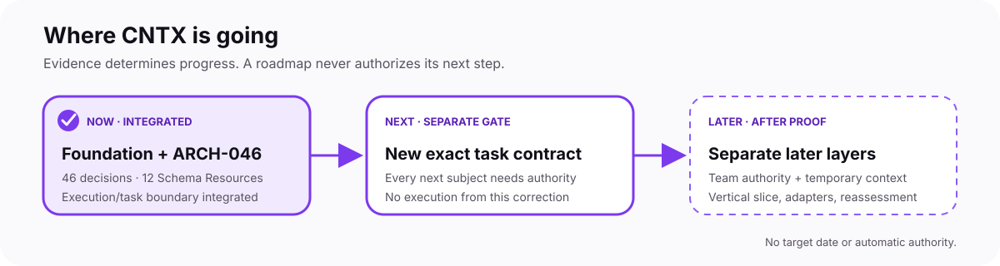

# CNTX roadmap

  <a href="README.md">Overview</a> ·
  <a href="ROADMAP.md"><strong>Roadmap</strong></a> ·
  <a href="docs/architecture/README.md">Architecture</a> ·
  <a href="docs/contracts/README.md">Contracts</a> ·
  <a href="docs/brand/README.md">Brand</a> ·
  <a href="CONTRIBUTING.md">Contribute</a>

This page answers three questions: what is integrated now, what decision comes
next, and what remains later. The complete public baseline and decision history
are preserved below in an expandable technical section.

<picture>
  <source media="(prefers-color-scheme: dark)" srcset="docs/assets/brand/cntx-roadmap-dark.svg">
  <source media="(prefers-color-scheme: light)" srcset="docs/assets/brand/cntx-roadmap-light.svg">
  
</picture>

## Simple view

| Horizon | State | Meaning |
| --- | --- | --- |
| **Now** | Phase 4A3.5 Proposed candidate | ARCH-045 documents one reusable fourteen-member Governing Definition Declaration and one frozen six-member Governing Declaration Set; no identity, schema, package, Binding, Tool, execution, or authority is created |
| **Next** | Exact-head candidate-acceptance gate | Separately decide whether to accept the exact Proposed ARCH-045 candidate; validation, review, Draft state, and mergeability do not accept or integrate it |
| **Later** | Not started | Status promotion, governed integration, practical pilots, adapters, portability/CI, and adversarial evaluation all remain separate later decisions |

`Integrated` does not mean finished, supported, certified, or ready to deploy.
`Next` does not mean authorized. CNTX advances through exact evidence and
separately governed decisions, not through a promised completion date.

## Mission and principles

CNTX is an open, model- and vendor-neutral specification for bounded context,
traceable work, explicit evidence, and human-controlled consequential
decisions. It does not prescribe a provider, runtime, industry, or private
implementation.

- Decompose work into small, explicit tasks.
- Give each participant only the context needed for that task.
- Keep assumptions, evidence, review, decisions, and handoffs distinct.
- Preserve human authority for consequential decisions and merges.
- Treat security, privacy, and scope boundaries as first-class constraints.

## Dependency-ordered technical path

| Order | Milestone | Status | Practical outcome |
| --- | --- | --- | --- |
| 1 | Validation and integrity contracts | Complete | Exact rules, tool identity, implementation identity, inputs, outputs, limits, and evidence |
| 2 | Local offline runner | Complete for the minimal slice | Reproducible execution of the 10 schemas and 203 synthetic cases |
| 3 | Cross-record integrity | Complete for the bounded practice slice | Detect missing, duplicate, ambiguous, or conflicting links between supplied records |
| 4 | Source, provenance and freshness controls | ARCH-038 through ARCH-044 and corrective Implementation `1.0.1` are integrated; ARCH-045 is Proposed only | Separately decide exact-head acceptance of the documentation-only ARCH-045 candidate |
| 5 | Execution and task controls | Later | Record tool/model/skill identity and classify light, moderate, heavy, or complex work separately from risk |
| 6 | Team authority and temporary context | Later | Support multiple principals, isolated task capsules, cleanup, and bounded archives |
| 7 | One real vertical-slice test | Later | Run one small task from contract and context through evidence, review, decision candidate, and cleanup |
| 8 | Adapters and reassessment | Later | Assess an optional OpenSpec mapping, one runtime adapter, adversarial tests, and the next human decision |

CNTX does not publish a completion timer for these milestones. Progress is
measured by exact evidence and separately governed gates. A successful runner
or pilot does not automatically prove broader conformance, acceptance, support,
release fitness, or deployment fitness.

<strong>Open the complete technical baseline and public project history</strong>

The sections below preserve the detailed decisions, identities, evidence,
limitations, and dependency history. They are the depth layer behind the short
roadmap above; they do not grant authority for their own next step.

### Current Package A decision

The first documentation dependency is now Accepted as
[ARCH-034](docs/architecture/validation-execution-record.md) with
[ADR-0034](docs/architecture/adr/0034-validation-execution-record.md) under
issue #114 and exact-head acceptance comment `5240683870`. It defines a
concrete Validation Execution Record identity,
initial version, and closed JSON representation for the eight ARCH-024 phases,
four separate outcomes, frozen context, diagnostics, limitations, claims, and
human-authority boundary.

Acceptance and integration create no executable schema, evidence package,
cross-record integrity rules, Tool or Implementation identity, dependency,
validator, runner, workflow, CI, release, support, hosting, or deployment.
Packages B, C, D, and E remain separate later gates.

### Current Package B decision

[ARCH-035](docs/architecture/validation-evidence-reproduction-package.md) and
[ADR-0035](docs/architecture/adr/0035-validation-evidence-reproduction-package.md)
are **Accepted** under issue #116, attributable EIGENAAR / Final Authority
issue-contract acceptance comment `5241232823`, and exact-head acceptance
comment `5241789812`. The documentation-only decision defines one non-Artifact
Validation-layer Evidence and Reproduction
Package Definition and one JSON Representation, each with initial Version
`1.0.0`, plus a strict closed twelve-property JSON root.

The decision keeps exact inputs, revisions, governing sources, evaluator
context, Validation Execution Records, evidence, reproduction procedures,
outputs, diagnostics, limitations, claim scope, and authority separate. It
requires package-local referential integrity and preserves bounded,
offline-first, deterministic, and fail-closed processing. It does not create
an executable schema, package instance, cross-record rule, Tool,
Implementation, dependency, validator, runner, workflow, CI, release,
publication, support, certification, hosting, or deployment. Acceptance and
integration allocate and activate only the stated identities and versions.
Packages C, D, and E remain unauthorized and separately governed.

### Current Package C decision

[ARCH-036](docs/architecture/test-manifest-cross-record-integrity-rules.md) and
[ADR-0036](docs/architecture/adr/0036-test-manifest-cross-record-integrity-rules.md)
are **Accepted** under issue #118, attributable EIGENAAR / Final Authority
issue-contract acceptance comment `5242339896`, and exact-head acceptance
comment `5243304427`. The documentation-only decision defines separate Test
Manifest, Cross-Record Integrity Rule, and
Cross-Record Integrity Evaluation Record Definition/JSON Representation
families, each with initial Version `1.0.0`.

The decision recognizes the nine direct manifests and one operation-based
State Snapshot manifest without changing their bytes, fixes deterministic
case identity and the exact static inventory at `203/38/165`, and defines
thirteen individually identified initial rule responsibilities for supplied-
record existence, exact pins, uniqueness and conflict detection, reference
resolution, Task Contract–Context Packet–Execution Result relationships,
Validation Execution Record and Package B links, visible role overlap, review
independence, prohibited self-review/self-acceptance, and disabled automatic
authority. Individual outcomes remain `satisfied`, `not-satisfied`,
`unverifiable`, or `not-evaluated`; no aggregate result is permitted.

Acceptance and integration allocate and activate only the stated identities,
versions, rules, and boundaries and create no executable schema,
manifest/rule/evaluation instance, Tool, Implementation, dependency,
evaluator, validator, resolver, runner, graph engine, workflow, CI, release,
publication, support, certification, hosting, or deployment. Package D and E
remain unauthorized and separately governed.

### Current Package D decision

[ARCH-037](docs/architecture/concrete-tool-implementation-contract.md) and
[ADR-0037](docs/architecture/adr/0037-concrete-tool-implementation-contract.md)
are **Accepted** under issue #120, attributable EIGENAAR / Final Authority
issue-contract acceptance comment `5243736163`, and exact-head acceptance
comment `5243941231`. The documentation-only decision defines one Tool
Identity and Version `1.0.0`, plus one separate
Python/`jsonschema` Implementation Identity and Version `1.0.0`.

Its exact supported set covers the ten Accepted Schema Resources, nine direct
and one operation-based Test Manifest, exact `203/38/165` inventory, Package
A/B/C definitions and representations, and all thirteen Accepted integrity
rules. It also fixes capability and non-capability boundaries, runtime
and dependency versions, configuration/environment responsibilities, bounded
logical input/output/diagnostic/evidence interfaces, deterministic ordering,
fail-closed processing, resource and security/privacy limits, no aggregate
result, and `automaticAuthority: false`.

The decision installed and executed nothing. It created no executable schema,
record instance, evaluator, validator, resolver, runner, code, library, SDK,
CLI, API, workflow, CI, release, publication, support, certification, hosting,
or deployment. Acceptance and integration activate only the exact identities,
versions, pins, capabilities, interfaces, and boundaries defined by the
decision. Package E remains separately governed.

### Completed Package E slice

The exact public [Package E issue/taskcontract](https://github.com/CNTX-PROJECT/CNTX/issues/122)
is completed. The [Minimal Validation and Integrity Slice](tools/minimal-validation-integrity-slice/README.md)
is integrated on public main at commit/tree
`c0e46a4f9d98d2b3d76d08fb3c870fd5c2475b9c` /
`97f3ee35a9bf6445ef78295a28f2a560a937eeef`.

The integrated slice contains strict JSON and path boundaries, a closed
five-artifact dependency lock, minimal Python source, bounded tests,
deterministic output,
the ten exact Schema Resources, both historical manifest forms, all 203 cases,
and all thirteen Accepted integrity rules. It preserves separate outcomes,
diagnostics, limitations, blocked/non-executed conditions, record/evidence
boundaries, concrete initial resource ceilings, and
`automaticAuthority: false`.

Clean Gate E3 evidence records two successful 29-test runs, two deterministic
runner executions, and exact agreement for `203/38/165` cases. Because the
frozen invocation supplied zero `subjectRecords`, all thirteen integrity rules
remained separately `not-evaluated` with `applicable=false`.

### Completed Phase 2/3 practice slice

Issue [#124](https://github.com/CNTX-PROJECT/CNTX/issues/124) is
closed/completed and PR [#125](https://github.com/CNTX-PROJECT/CNTX/pull/125)
is merged. The [bounded cross-record integrity practice slice](tools/minimal-validation-integrity-slice/practice/cross-record-integrity/README.md)
is integrated at commit/tree
`954c266a28fd9f15e037b1716925d9eb1a1f031d` /
`33a37a0c6db72ea34c231f0544e4e2d3f2b35a26`.

Four complete strict JSON invocations contain `8/9/10/1` synthetic public-safe
records. Two separately authorized isolated environments each executed all four
scenarios. Actual outcomes matched the frozen expected matrix exactly:

- coherent: thirteen `satisfied`;
- dangling: twelve `satisfied` and one `not-satisfied`;
- restricted: eleven `satisfied` and two `unverifiable`;
- minimal: seven `satisfied` and six genuinely inapplicable `not-evaluated`.

Each execution also matched all `203/38/165` schema-case expectations and kept
all eight validation phases separate. The evidence and review are
non-independent; hard outer process limits, operating-system network isolation,
and peak working set remain unproven or unobserved. The slice changes no schema,
historical manifest, testcase, Definition, Representation, architecture, ADR,
workflow, CI, release, support, hosting, deployment, or authority boundary.
These counts and outcomes are not an aggregate verdict. `automaticAuthority`
remains false.

### Accepted Phase 4A1 Definition

[ARCH-038](docs/architecture/epistemic-provenance-freshness-extension-module-definition.md)
and
[ADR-0038](docs/architecture/adr/0038-epistemic-provenance-freshness-extension-module-definition.md)
are **Accepted** under issue #128, attributable EIGENAAR / Final Authority
issue-contract acceptance comment `5251980826`, and exact-head acceptance
comment `5252557346` on candidate commit
`e6700258c584deaabf028e8d339680567ed1715f` and tree
`664f00045fc7dcfb26ff2d9cf12c5787c0524493`. The documentation-only Definition
specifies exactly one Epistemic Provenance and Freshness Extension Module
Definition with local name `epistemic-provenance-freshness`,
Definition Identifier
`https://github.com/CNTX-PROJECT/CNTX/extension-module-definitions/epistemic-provenance-freshness`,
and initial Definition Version `1.0.0`.

The Definition defines only additive logical source categories, exact source
identity/revision and provenance responsibilities, four separate temporal
coordinates, explicit digest and freshness-policy pins, clock/reference
provenance, derivation, visible condition states, fail-closed behavior, no
aggregate result, and `automaticAuthority: false`. Proposed status and review
allocate or activate nothing. Exact-head acceptance plus separately governed
integration to `main` allocates and activates only the exact Identifier and
Version as the integrated Accepted Definition. Status promotion, branch or
repository presence, Ready-for-review, review, and mergeability do not by
themselves integrate or activate it. No Profile, representation, schema, rule,
tool, implementation, execution, evidence, support, release, hosting, or
deployment is created or authorized.

### Accepted Phase 4A2 Profile Definition

[ARCH-039](docs/architecture/context-packet-epistemic-provenance-freshness-profile-definition.md)
and
[ADR-0039](docs/architecture/adr/0039-context-packet-epistemic-provenance-freshness-profile-definition.md)
are **Accepted** under issue #130, attributable EIGENAAR / Final Authority
issue-contract acceptance comment `5254030218`, and exact-head acceptance
comment `5255793839` on candidate commit
`4e0af44a238713f41692ce864b9f3616ff39c4c9` and tree
`927ca72b1f692a045f1746ba800e699d9ee14576`. The documentation-only Definition
specifies Profile local name
`context-packet-epistemic-provenance-freshness`, Profile Definition Identifier
`https://github.com/CNTX-PROJECT/CNTX/profile-definitions/context-packet-epistemic-provenance-freshness`,
initial Version `1.0.0`, and exactly two Profile Subjects: the Accepted Context
Packet Contract Definition `1.0.0` and Accepted ARCH-038 Extension Module
Definition `1.0.0`.

The Definition only selects and narrows capabilities already present in those
exact subjects. It requires bounded source roles, exact identity/revision or an
explicit unfavorable condition, separate epistemic and temporal dimensions,
exact applicable freshness-policy and clock/reference context, explicit digest
and derivation boundaries, visible adverse/restricted conditions, fail-closed
individual outcomes, non-aggregation, and `automaticAuthority: false`.
The preceding Proposed status allocated or activated nothing. Exact-head
acceptance plus separately governed integration to `main` allocates and
activates only the exact Identifier and Version as the integrated Accepted
Definition. Status promotion, branch or repository presence, validation,
review, Ready-for-review, and mergeability do not by themselves integrate,
allocate, or activate it. No
Profile instance, representation, schema, policy, rule, tool, implementation,
execution, evidence, release, publication, support, hosting, deployment, or
consequential authority is created.

### Accepted Phase 4A3.1 Module representation boundary

[ARCH-040](docs/architecture/epistemic-provenance-freshness-extension-module-json-representation-boundary.md)
and
[ADR-0040](docs/architecture/adr/0040-epistemic-provenance-freshness-extension-module-json-representation-boundary.md)
are **Accepted** under issue #139, attributable EIGENAAR / Final Authority
issue-contract acceptance comment `5259097128`, and exact-head acceptance
comment `5259328712` on candidate commit
`60d815ed9545c5ab16a4531df9a83cc00ed65340` and tree
`4671ec2dac4df5029dddaaa5876375ba2b7b749d`. They are the first
representation-first dependency of Phase 4A3. Later separately governed
integration was squash-merged as commit
`97d72439bcad31c144352091cb74eaac342f0ae3` with exact tree
`831c8e953de06a1dd8b124904779653df43543fa`; issue #139 is
closed/completed.

The documentation-only decision defines one closed thirteen-property
JSON-compatible instance-data model for one bounded source declaration under
exact ARCH-038 Definition Identifier/Version pins. It carries the six existing
source categories, eight information conditions, four separate ARCH-024
outcomes, exact source/claim/provenance responsibilities, four temporal
coordinates, digest and policy pins, clock/reference context, finite
derivation, limitations, adverse/restricted information, and attributable
roles without creating an aggregate result or automatic authority.

The decision changes no Core Artifact JSON or Context Packet schema and
allocates no Representation or Schema Identifier/Version. It creates no `$id`,
Schema Resource, schema assertion, testcase, fixed expected result, rule,
Tool/Implementation version, code, runner, execution, evidence, release,
support, certification, hosting, or deployment. The preceding Proposed status,
branch or repository presence, validation, review, and mergeability allocated
or activated nothing. Exact-head acceptance established Accepted status only;
the later integration creates no Schema Resource, testcase, rule,
implementation, execution, evidence, release, support, certification, hosting,
deployment, or automatic authority. A Module Definition Schema Resource and
cases remain a later separate gate.

### Accepted correction gate before Phase 4A3.2

[ARCH-041](docs/architecture/minimal-validation-integrity-slice-corrective-version-boundary.md)
and
[ADR-0041](docs/architecture/adr/0041-minimal-validation-integrity-slice-corrective-version-boundary.md)
are **Accepted** under issue #141, attributable EIGENAAR / Final Authority
issue-contract acceptance comment `5262502160`, and exact-head
candidate-acceptance comment `5262723710` on candidate commit/tree
`89f7a46319fd64e517e160b03b390e90bf1534ed` /
`2c519280a71491d3484bfebfc809f7e50e3bed50`, prepared from public baseline
commit/tree `97d72439bcad31c144352091cb74eaac342f0ae3` /
`831c8e953de06a1dd8b124904779653df43543fa`. Integration-acceptance comment
`5263076268` authorized the exact expected-head squash merge of PR #142.
Integrated main commit/tree is
`4ea5aa4e76b6bb6bd38919fa741d93cb07495765` /
`fb7cfee3f4cd5edf3503d01f6601ef2ff1d4321f`; completion comment `5263094988`
records issue #141 closed/completed and branch cleanup after tree equality.

The documentation-only boundary preserves immutable Tool and Implementation
Version `1.0.0` history. It defines exact Git-blob bytes as the subject for new
repository-file pins, accepts only corrective Implementation Version `1.0.1`
as the exact later integration target, and bounds the behavior change to
rejecting a colon in every caller-supplied relative path segment on every
supported host. Later corrective lock, invocation, and matrix subjects must
use new revisions instead of overwriting historical objects.

Runtime/dependency portability, workflow/CI, Actions settings, correction
implementation, execution, evidence, and Phase 4A3.2 remained separate at this
architecture gate.
ARCH-041 integration allocates and activates only the exact Accepted corrective
Implementation Version `1.0.1` boundary; it does not itself implement or prove
the correction.

### Completed corrective Implementation 1.0.1 lifecycle

Accepted issue #143 and attributable EIGENAAR / Final Authority issue-
acceptance comment `5263430981` govern one source-first candidate. Its first
commit/tree `1d28b2df55db86b82d23c011eba809a484559272` /
`ac73860d2908efa9ec4eaf5b7e814de44fd2beb1` makes only the unconditional
colon-bearing relative-segment rejection, changes only the Implementation
Version to `1.0.1`, and adds a separate corrective dependency-lock revision
with the five historical artifact pins unchanged.

The second candidate commit adds only new `corrective-1.0.1` matrix and
invocation revisions plus current-state documentation. Every new repository-
file digest identifies exact LF Git-blob bytes in the first commit/tree. The
historical `1.0.0` lock, four invocations, matrix, schemas, tests, outputs,
evidence, reviews, completion records, and seven issue-#126 pins remain
unchanged. The new four-scenario revision preserves the separate expected
patterns `13 satisfied`; `12 satisfied / 1 not-satisfied`; `11 satisfied / 2
unverifiable`; and `7 satisfied / 6 not-evaluated` without an aggregate result.

The later bounded execution produced accepted exact evidence for the four
separate practice scenarios and the full 29-test suite on the authorized
Windows environment. Corrective Implementation Version `1.0.1` was then
separately integrated as main commit/tree
`c7650274a2818a5c3eaca0abfb0bc86fd747e4b2` /
`f7dd74615c11e5390c0680f862668f425285e7f7`. Exact CPython `3.13.14` and the
retained Windows acquisition set establish no Linux, macOS, or multi-platform
portability. The result creates no CI/Actions, support, release, certification,
hosting, or deployment claim.

### Accepted and integrated Phase 4A3.2 Module Definition Schema Resource

Accepted issue #145 and attributable Owner / Final Authority issue-contract
acceptance comment `5267576754` governed one Proposed ARCH-042 candidate prepared
directly from public baseline commit/tree
`c7650274a2818a5c3eaca0abfb0bc86fd747e4b2` /
`f7dd74615c11e5390c0680f862668f425285e7f7`. It adds one architecture source,
one matching ADR, one Draft 2020-12 Module Definition Schema Resource, and one
direct manifest with 48 separate synthetic cases: 8 expected valid and 40
expected invalid. Five existing navigation/current-state files are updated;
all other 191 baseline paths remain protected.

Attributable exact-head candidate-acceptance comment `5269689952` on candidate
commit/tree `d10fb23bdec7c13bb1154bd538d8e691d486fcce` /
`071a9909efcee1d4d74d7ff65b0b05da30e73875` establishes Accepted status. The
successful isolated candidate execution remains evidence for exactly that
candidate and was not repeated for status promotion or integration.
Attributable integration-acceptance comment `5271035681` and completion comment
`5271254252` record governed integration through PR #146 at public `main`
commit/tree `9f482043f76c792f6c2e1e96eb4a535ee26b3a99` /
`7b2f45791e3b7bff7e856f26fff9b22598c06709`. Issue #145 is closed/completed and
the task branch is absent locally and publicly.

The candidate binds only the already Accepted
`epistemic-provenance-freshness` Definition Identifier and Version `1.0.0` to
one integrated Accepted canonical Schema `$id`. Its 13
required root responsibilities
cover governance, declaration, source, claims, provenance, temporal and digest
integrity, policies, derivation, conditions, evaluations, limitations, and
attributable human authority while prohibiting any `automaticAuthority`
member. The `48/8/40` inventory remains separate from the
historical Core `203/38/165` cases and creates no aggregate result or gate.
The preceding Proposed status and Accepted status alone allocated or activated
nothing. Only the completed separately governed integration allocates and
activates the exact Schema Identifier, Version, and canonical `$id`.
Integration does not expand the supported Tool input set, repeat execution,
create evidence, or authorize a rule, implementation, workflow, CI, release,
support, certification, hosting, or deployment.

### Accepted and integrated Phase 4A3.3 Profile application JSON representation

Accepted issue #147 and attributable issue-contract acceptance comment
`5273569440`, plus attributable exact-head candidate-acceptance comment
`5277015423` on commit/tree
`05e55ded2a7d0276ee9832b0bdff973b8b19b0d5` /
`d8d5855b0c986f008da2b123cd21f2cd6c6f0b2b`, govern the Accepted
documentation-only ARCH-043 decision. It
defines one external closed fourteen-member application record for exact
Profile Definition `1.0.0`, its exact two subjects, one exact Context Packet
revision, and one exact approved Task Contract revision. Every selected packet
source is associated exactly once to one exact ARCH-040 Module declaration by
a zero-based packet-local locator plus exact repeated `sourceReference` check;
the locator creates no precedence or cross-revision identity.

The Accepted representation preserves six source categories, seventeen
dimensions, four temporal coordinates, exact policy/digest/derivation
boundaries, eight information conditions, four evaluation outcomes,
limitations, adverse/restricted information, non-aggregation, and final-human
authority. It adds no Core property, Profile instance, schema, case, policy
instance, rule, Tool capability, execution, evidence, release, deployment, or
automatic authority. The preceding Proposed status allocated or activated
nothing. Exact-head acceptance and status promotion established Accepted status
only. Separate integration authority comment `5277937526` and completion
comment `5277961696` record PR #148 integration at public `main` commit/tree
`eec00d698512533c3d40f985fe5d588cd03438f1` /
`87a2d5aaf01e3f7c45b4fb4e3d8aa40a21dc046a`. Issue #147 is closed/completed and
the task branch is absent locally and publicly. Integration established only
the exact representation boundary and created no schema, case, Tool support,
execution, evidence, release, deployment, or later-phase authority.

### Accepted and integrated Phase 4A3.4 Profile Definition Schema Resource

Issue #149, attributable EIGENAAR / Final Authority issue-contract acceptance
comment `5279967413`, and source-preserving correction addenda `5280408320` and
`5280832992` authorized one bounded Proposed ARCH-044 candidate from public
baseline commit/tree
`eec00d698512533c3d40f985fe5d588cd03438f1` /
`87a2d5aaf01e3f7c45b4fb4e3d8aa40a21dc046a`. The candidate adds one architecture
source, matching ADR, standalone Draft 2020-12 Profile Definition Schema
Resource, and one operation-based manifest with 72 fixed cases: 11 expected
valid and 61 expected invalid. Seven existing navigation/current-state paths
receive only the accepted bounded updates; all other 195 baseline paths remain
protected. Attributable exact-head candidate-acceptance comment `5285702199`
accepts candidate commit/tree
`7420e5d179ab965bfda58780df4f41a08a0b62de` /
`56d1808cb95f3dd5a0b5d84f2a8e440891dff5e6`. Exact-head acceptance and the
status-only promotion established Accepted status; governed integration then
remained a separate gate.

The addendum corrects only the baseline link inventory to exactly `1489
Markdown / 27 HTML` and `1297 local / 219 external`. It leaves the exact
baseline, semantics, paths, identities, schema/case design, validation
requirements, Proposed status, and lifecycle boundary unchanged.

The Accepted Definition Schema Identifier is
`https://github.com/CNTX-PROJECT/CNTX/schemas/profiles/context-packet-epistemic-provenance-freshness`,
Schema Version is independently `1.0.0`, and the version-qualified canonical
`$id` ends in `/1.0.0`. The resource evaluates exactly the closed fourteen-
member ARCH-043 record with finite limits, exactly 52 root `$defs`, and an exact
separate `207/207/0` total/internal/external reference inventory. It fixes only
schema-local structure; packet/task equality, complete source association,
projected-key uniqueness, opaque-reference resolution, graph semantics,
narrowing-only meaning, source truth, conformance, approval, and authority are
not schema-provable.

The operation-based manifest deep-copies one complete `baseInstance` and applies
only ordered RFC 6901 `add`, `remove`, or `replace` test operations. The
`72/11/61` cases remain separate from Core `203/38/165` and ARCH-042 `48/8/40`;
no count is an aggregate score, conformance verdict, gate, certification, or
authority. The final authorized local validation evaluated every case exactly
once and matched all `72/72` expectations (`11 valid / 61 invalid`) with zero
mismatches; it remains local, non-governing, non-independent, and bound only to
the accepted candidate commit/tree. This status-only promotion is not a new
execution or evidence instance, and the minimal Tool's exact ten-schema
supported set remains unchanged. Separately authorized PR #150 integrated the
unchanged Accepted candidate into `main` at commit/tree
`1d9e4667d68cce6e0289464c821bcd95e1d355ae` /
`3feeb1ce8ce2c0a7b45b88e42c9d668fc856d367`, under integration-authority
comment `5286010813` and completion comment `5286062635`. Issue #149 is
closed/completed and its task branch is absent locally and publicly. All 12
Schema Resources and the separate Core `203/38/165`, Module `48/8/40`, and
Profile `72/11/61` inventories are integrated without a new execution/evidence
instance or Tool support. Phase 4A3.5, release, and deployment require separate
authority.

### Proposed Phase 4A3.5 Governing Declaration JSON representation boundary

Issue #151 and attributable EIGENAAR / Final Authority issue-contract
acceptance comment `5286906192` authorize one documentation-only ARCH-045
candidate from exact public baseline commit/tree
`1d9e4667d68cce6e0289464c821bcd95e1d355ae` /
`3feeb1ce8ce2c0a7b45b88e42c9d668fc856d367`. The candidate documents one
reusable closed fourteen-member `GoverningDefinitionDeclaration`, an exact
21-responsibility mapping, and one closed six-member frozen
`GoverningDeclarationSet` preserving all eleven ARCH-031 set invariants.

The model keeps exact Definition keys, Required and Optional dependencies,
separate Profile roots, explicit `present`/`none` Schema Resource state,
provenance, limitations, conditions, claim scope, lifecycle traceability,
attributable roles, non-aggregation, fail-closed processing, and
`automaticAuthority: false` distinct and visible. It remains outside every
existing Core Artifact Instance. Proposed status creates no declaration/set
identity or version, package/bundle representation, media type, canonical
serialization, Schema Resource, testcase, Binding, Tool/Implementation,
execution, evidence, approval, release, support, certification, hosting,
deployment, or later-phase authority. Exact-head acceptance, status promotion,
integration, merge, and cleanup remain separate gates.

## Detailed project status and roadmap

CNTX has completed its initial Public-Core specification and prerelease cycle within the Accepted ARCH-027 completion and maintenance boundary. Public `main` records [Accepted and integrated architecture through ARCH-044](docs/architecture/README.md), including the bounded corrective Implementation Version `1.0.1`, its exact evidence, the Module Definition Schema Resource with 48 cases, the closed Profile application representation, and the Profile Definition Schema Resource with 72 cases. This documentation-only branch contains one additional Proposed ARCH-045 architecture source/ADR pair awaiting exact-head acceptance, plus nine Accepted artifact contracts, 12 integrated Accepted Schema Resources, one integrated minimal validation and integrity Tool/Implementation slice, and one immutable unsupported prerelease, 0.1.0-prealpha.1. CNTX remains model-, vendor-, runtime-, and domain-agnostic. The separate case inventories remain Core `203/38/165`, Module `48/8/40`, and Profile `72/11/61`; no descriptive sum or ratio is an aggregate verdict. ARCH-044 integration created no Tool support or new execution/evidence instance. Proposed ARCH-045 creates no identity/version, schema, package/bundle, Binding, Tool/Implementation, execution/evidence, or authority. Neither the integrated slice, either Accepted Definition, either representation boundary, ARCH-041, corrective Implementation `1.0.1`, ARCH-042 through ARCH-044, nor Proposed ARCH-045 creates a supported release line, support service, certification, hosting, deployment, workflow, CI, product, or final-human authority.

The [artifact-contract index](docs/contracts/README.md) includes nine accepted, binding subordinate artifact-specific contracts: Project Charter, Workstream, Task Contract, Context Packet, Execution Result, Evidence Bundle, Review Record, Decision Record, and State Snapshot. None introduces an executable schema, template, validator, state engine, synchronization engine, workflow, runtime, or product functionality. No canonical artifact contract remains listed as future work; the accepted status does not authorize a follow-on phase. CNTX remains a public core that is model-, vendor-, runtime-, and domain-agnostic and remains independent of private reference implementations.

The architecture index includes the **Accepted**, documentation-only [Common Artifact Envelope schema boundary](docs/architecture/common-artifact-envelope-schema-boundary.md) with [ADR-0004](docs/architecture/adr/0004-common-artifact-envelope-schema-boundary.md). ARCH-004 classifies shared metadata ownership before any executable schema decision. Its acceptance authorizes no concrete fields, serialization, validator, Layer 5 mechanism, runtime, or follow-on implementation.

The architecture index also includes the **Accepted**, documentation-only [Common Artifact Envelope representation boundary](docs/architecture/common-artifact-envelope-representation-boundary.md) with [ADR-0005](docs/architecture/adr/0005-common-artifact-envelope-representation-boundary.md). ARCH-005 identifies what a future common definition must be capable of representing and the order of later schema-foundation decisions; it selects no fields, schema language, serialization, validator, runtime, or implementation and authorizes no follow-on phase.

The architecture index now includes the **Accepted**, documentation-only [Common Artifact Envelope schema identity and initial version policy](docs/architecture/common-artifact-envelope-schema-identity-version-policy.md) with [ADR-0006](docs/architecture/adr/0006-common-artifact-envelope-schema-identity-version-policy.md). ARCH-006 establishes one technology-neutral logical identity and reserves `1.0.0` only as the initial accepted version target for a future executable common definition. It creates no concrete Schema Identifier, executable schema, active Schema Version, schema-language or dialect choice, serialization, validator, Layer 5 mechanism, runtime, implementation, release, or deployment.

The architecture index now includes the **Accepted**, documentation-only [Common Artifact Envelope schema language and dialect](docs/architecture/common-artifact-envelope-schema-language-dialect.md) with [ADR-0007](docs/architecture/adr/0007-common-artifact-envelope-schema-language-dialect.md). ARCH-007 selects JSON Schema Draft 2020-12 and its standard vocabulary profile as a fixed processing model. It creates no executable schema, concrete `$id`, composition or packaging model, artifact Serialization Binding, validator, Layer 5 mechanism, runtime, implementation, release, or deployment; composition and packaging remain a separate later decision.

The architecture index now includes the **Accepted**, documentation-only [Common Artifact Envelope schema composition and packaging](docs/architecture/common-artifact-envelope-schema-composition-packaging.md) with [ADR-0008](docs/architecture/adr/0008-common-artifact-envelope-schema-composition-packaging.md). ARCH-008 selects one canonical root Schema Resource per version, internal `$defs`, static exact-version references, standalone canonical resources, optional identity-preserving Compound Schema Document bundles, and offline-first resolution without creating an executable schema, concrete `$id`, active Schema Version, artifact Serialization Binding, validator, runtime, implementation, release, or deployment.

The architecture index now includes the **Accepted** [Common Artifact Envelope executable schema definition](docs/architecture/common-artifact-envelope-executable-schema.md) with [ADR-0009](docs/architecture/adr/0009-common-artifact-envelope-executable-schema.md), the Accepted [`1.0.0` Schema Resource](schemas/common-artifact-envelope/1.0.0/schema.json), and its [synthetic test evidence](tests/schemas/common-artifact-envelope/1.0.0/cases.json). ARCH-009 defines a closed envelope object for the nine accepted Artifact Types, coupled artifact/contract/schema pins, optional provenance references, and optional digest evidence. Acceptance and schema validity do not authorize an artifact-specific schema or payload, select an artifact Serialization Binding, or provide a validator, resolver, runtime, product, release, or deployment.

The architecture index also contains the **Accepted**, documentation-only [Artifact-Specific Schema Family and Canonical Artifact Container Boundary](docs/architecture/artifact-specific-schema-family-container-boundary.md) with [ADR-0010](docs/architecture/adr/0010-artifact-specific-schema-family-container-boundary.md). The decision allocates nine technology-neutral artifact-specific logical Schema Identities and inactive `1.0.0` targets, selects a closed full-artifact root with mandatory `envelope` and `payload`, and fixes the exact Accepted common-envelope reference at `/envelope`. It creates no executable artifact-specific schema or payload, concrete artifact-specific `$id`, active Schema Version, binding, validator, runtime, implementation, release, or deployment; its acceptance authorizes no follow-on phase.

The architecture index now includes the **Accepted**, documentation-only [Canonical Contract Definition Identity, Initial Version, and Source Binding](docs/architecture/contract-definition-identity-version-binding.md) with [ADR-0011](docs/architecture/adr/0011-contract-definition-identity-version-binding.md). ARCH-011 allocates nine stable Contract Definition Identifiers, independent initial `1.0.0` versions, and exact Accepted-source bindings for CONTRACT-001 through CONTRACT-009. The nine integrated identifier/version/source-binding pairs are Accepted and active. The decision changes no contract meaning, creates no executable artifact-specific schema, binding, resolver, validator, runtime, implementation, release, or deployment, and grants no follow-on authority.

The architecture index now also exposes the **Accepted** [Project Charter Executable Schema Definition](docs/architecture/project-charter-executable-schema.md) with [ADR-0012](docs/architecture/adr/0012-project-charter-executable-schema.md), the Accepted [Project Charter Schema Version `1.0.0`](schemas/project-charter/1.0.0/schema.json), and its [synthetic validation cases](tests/schemas/project-charter/1.0.0/cases.json). ARCH-012 composes the exact Accepted Common Artifact Envelope with a closed CONTRACT-001 payload and exact Project Charter Artifact Type, governing Contract, and governing Schema pins. Governed integration to `main` activates the exact Schema Version. Acceptance, schema validity, or repository presence grants no contract conformance, authority, release, deployment, implementation, or authority for the next artifact-specific schema.

The architecture index now also exposes the **Accepted** [Workstream
Executable Schema Definition](docs/architecture/workstream-executable-schema.md)
with [ADR-0013](docs/architecture/adr/0013-workstream-executable-schema.md), the
Accepted [Workstream Schema Version `1.0.0`](schemas/workstream/1.0.0/schema.json),
and its [synthetic validation cases](tests/schemas/workstream/1.0.0/cases.json).
ARCH-013 composes the exact Accepted Common Artifact Envelope with a closed
twelve-property CONTRACT-002 payload, exact Workstream Artifact Type and
governing-definition pins, and an opaque governing Project Charter
Artifact Instance/Revision pin without a Project Charter schema `$ref`.
Governed integration to `main` activates the exact Schema Version. Acceptance,
schema validity, or repository presence grants no contract conformance,
approval, authority, release, deployment, implementation, merge permission,
or Task Contract schema authority.

The architecture index now also exposes the **Accepted** [Task Contract
Executable Schema Definition](docs/architecture/task-contract-executable-schema.md)
with [ADR-0014](docs/architecture/adr/0014-task-contract-executable-schema.md),
the Accepted [Task Contract Schema Version `1.0.0`](schemas/task-contract/1.0.0/schema.json),
and its [synthetic validation cases](tests/schemas/task-contract/1.0.0/cases.json).
ARCH-014 composes the exact Accepted Common Artifact Envelope with a closed
eleven-property CONTRACT-003 payload, exact Task Contract Artifact Type and
governing-definition pins, and separate opaque governing Project Charter and
Workstream Artifact Instance/Revision pins without either artifact-specific
schema `$ref`. Scope, actions, resources, authority, context, evidence,
decisions, and lifecycle remain declarative. Governed integration to `main`
activates the exact Schema Version. Acceptance, schema validity, or repository
presence grants no contract conformance, task authority, permission
enforcement, integration authority, release, deployment, implementation,
merge permission, Context Packet schema authority, or follow-on authority.

The architecture index now also exposes the **Accepted** [Context
Packet Executable Schema Definition](docs/architecture/context-packet-executable-schema.md)
with [ADR-0015](docs/architecture/adr/0015-context-packet-executable-schema.md),
the Accepted [Context Packet Schema Version `1.0.0`](schemas/context-packet/1.0.0/schema.json),
and its [synthetic validation cases](tests/schemas/context-packet/1.0.0/cases.json).
ARCH-015 composes the exact Accepted Common Artifact Envelope with a closed
thirteen-property CONTRACT-004 payload, exact Context Packet Artifact Type and
governing-definition pins, and one opaque governing Task Contract Artifact
Instance/Revision pin without any artifact-specific schema `$ref`. Source
references, representation treatments, relevance, freshness, access,
sufficiency, minimization, stop, and lifecycle information remain declarative.
The resource provides no automatic selection, retrieval, ranking, RAG,
disclosure, transformation, prompt, workflow, or runtime behavior. Governed
integration to `main` activates the exact Schema Version. Acceptance, schema
validity, or repository presence grants no contract conformance, task
authority, source access, retrieval or disclosure permission, merge permission,
release, deployment, Execution Result schema authority, or follow-on authority.

The architecture index now also exposes the **Accepted** [Execution Result
Executable Schema Definition](docs/architecture/execution-result-executable-schema.md)
with [ADR-0016](docs/architecture/adr/0016-execution-result-executable-schema.md),
the Accepted [Execution Result Schema Version `1.0.0`](schemas/execution-result/1.0.0/schema.json),
and its [synthetic validation cases](tests/schemas/execution-result/1.0.0/cases.json).
ARCH-016 composes the exact Accepted Common Artifact Envelope with a closed
fourteen-property CONTRACT-005 payload, one opaque governing Task Contract
pin, and explicit opaque Context Packet pin declarations without any
artifact-specific schema `$ref`. Output, action, resource, provenance, check,
criteria, limitation, stop, security/privacy, and traceability values remain
bounded evidentiary claims. Governed integration to `main` activates the exact
Schema Version. Acceptance, schema validity, or repository presence grants no
correctness, completion, contract conformance, integration authority, release,
deployment, merge permission, Evidence Bundle schema authority, or follow-on
authority.

The architecture index now also exposes the **Accepted** [Evidence Bundle
Executable Schema Definition](docs/architecture/evidence-bundle-executable-schema.md)
with [ADR-0017](docs/architecture/adr/0017-evidence-bundle-executable-schema.md),
the Accepted [Evidence Bundle Schema Version `1.0.0`](schemas/evidence-bundle/1.0.0/schema.json),
and its [synthetic validation cases](tests/schemas/evidence-bundle/1.0.0/cases.json).
ARCH-017 composes the exact Accepted Common Artifact Envelope with a closed
fifteen-property CONTRACT-006 payload, one opaque governing Task Contract pin,
exact reviewable-subject declarations, explicit opaque artifact relationships,
Evidence Items, claim traceability, and bounded provenance, quality,
limitation, security/privacy, and lifecycle declarations without any
artifact-specific schema `$ref`. The accepted resource implements no collection,
retrieval, scoring, verification, access, disclosure, approval, acceptance,
workflow, release, deployment, or merge mechanism. Creation, validation,
review, schema validity, or repository presence grants no contract conformance,
source truth, relevance, sufficiency, correctness, acceptance, integration,
release, deployment, merge permission, Review Record schema authority, or
follow-on authority. Governed integration to `main` activates the exact Schema
Version; acceptance and activation authorize no Review Record schema or other
follow-on work.

The architecture index now also exposes the **Accepted** [Review Record
Executable Schema Definition](docs/architecture/review-record-executable-schema.md)
with [ADR-0018](docs/architecture/adr/0018-review-record-executable-schema.md),
the Accepted [Review Record Schema Version `1.0.0`](schemas/review-record/1.0.0/schema.json),
and its [synthetic validation cases](tests/schemas/review-record/1.0.0/cases.json).
ARCH-018 composes the exact Accepted Common Artifact Envelope with a closed
sixteen-property CONTRACT-007 payload, separates Review Authority and Execution
Authority, and records exact reviewable subjects, nine opaque artifact
relationship categories, findings, evidence use, uncertainty, dissent,
recommendations, peer review, correction, security/privacy, escalation, stop,
and lifecycle traceability without any artifact-specific schema `$ref`. The
accepted resource implements no reviewer identity or specialty system, review,
retrieval, scoring, severity, confidence, verdict, approval, voting, synthesis,
decision, workflow, runtime, access, disclosure, retention, release,
deployment, or merge mechanism. Creation, validation, review, schema validity,
or repository presence grants no contract conformance, specialist authority,
review quality, acceptance, integration, release, deployment, merge permission,
Decision Record schema authority, or follow-on authority. Governed integration
to `main` activates the exact Schema Version under issue #62 and EIGENAAR
acceptance comment `5218629573`; acceptance and activation authorize no
Decision Record schema or other follow-on work.

The architecture index now also exposes the **Accepted** [Decision Record
Executable Schema Definition](docs/architecture/decision-record-executable-schema.md)
with [ADR-0019](docs/architecture/adr/0019-decision-record-executable-schema.md),
the Accepted [Decision Record Schema Version `1.0.0`](schemas/decision-record/1.0.0/schema.json),
and its [synthetic validation cases](tests/schemas/decision-record/1.0.0/cases.json).
ARCH-019 composes the exact Accepted Common Artifact Envelope with a closed
seventeen-property CONTRACT-008 payload and preserves exact authority and
approved-revision provenance, one bounded question and outcome, basis, nine
opaque artifact relationships, inputs, timing, scope, consequences, downstream
boundaries, peer changes/conflicts, roles, external records, security/privacy,
restricted basis, lifecycle, and history without any artifact-specific schema
`$ref`. The accepted resource allocates no authority or identity, proves no approval,
makes or executes no decision, changes no state, and implements no retrieval,
reasoning, recommendation, voting, conflict-resolution, workflow, runtime,
access, disclosure, retention, acceptance, integration, release, deployment,
publication, or merge mechanism. Creation, validation, review, schema validity,
or repository presence grants no acceptance, activation, State Snapshot schema,
or follow-on authority. Governed integration to `main` activates the exact
Schema Version under issue #64 and EIGENAAR acceptance comment `5219310944`;
acceptance and activation authorize no State Snapshot schema or other follow-on
work.

The architecture index now also exposes the **Accepted** [State Snapshot
Executable Schema Definition](docs/architecture/state-snapshot-executable-schema.md)
with [ADR-0020](docs/architecture/adr/0020-state-snapshot-executable-schema.md),
the [State Snapshot Schema Version `1.0.0`](schemas/state-snapshot/1.0.0/schema.json),
and its [synthetic validation cases](tests/schemas/state-snapshot/1.0.0/cases.json).
ARCH-020 composes the exact Accepted Common Artifact Envelope with a closed
eighteen-property CONTRACT-009 payload and preserves Derived/non-authoritative
classification, controlling sources and exact revisions or pinning
limitations, provenance, temporal/freshness separation, reported state and
claims, evidence/review/decision/integration traceability, nine artifact
relationships, uncertainty, incomplete work and stops, snapshot history, five
peer relations, bounded handoff, security/privacy, and non-automatic lifecycle
effects without any artifact-specific schema `$ref`. The accepted resource
allocates no authority or identity, proves no source or claim, retrieves no content,
calculates no freshness, resolves no conflict, changes or synchronizes no state,
and implements no workflow, runtime, access, disclosure, retention,
verification, release, deployment, publication, or merge mechanism. Creation,
validation, review, schema validity, or repository presence did not grant
acceptance or activation. Exact-head acceptance is recorded in issue comment
`5219885650`; governed integration to `main` activates the exact Schema Version.
Acceptance and activation authorize no further phase automatically.

The **Accepted** [CNTX Public Core Completion Boundary and Remaining Layer
Roadmap](docs/architecture/public-core-completion-boundary-roadmap.md) with
[ADR-0021](docs/architecture/adr/0021-public-core-completion-boundary-roadmap.md)
under issue #68 and EIGENAAR acceptance comment `5220966638` records that the
contract-and-schema foundation is complete while portable
Serialization Binding, schema-resource resolution/catalog, validation output,
conformance evidence, and release-readiness remain separately governed future
decisions. The Accepted decision does not make CNTX release-ready and authorizes no
implementation, runtime, product, release, publication, deployment, or
follow-on work.

The architecture index also exposes the **Accepted** [CNTX Core Artifact
Serialization Binding Architecture](docs/architecture/core-artifact-serialization-binding.md)
(ARCH-022)
with [ADR-0022](docs/architecture/adr/0022-core-artifact-serialization-binding.md)
under issue #70 and EIGENAAR acceptance comment `5221466569`. The
documentation-only decision defines one logical Core Artifact JSON binding
identity and initial Binding Version `1.0.0`, activated by governed integration,
RFC 8259 `application/json`, UTF-8 without BOM, duplicate-name rejection,
bounded number and Unicode handling, non-semantic object ordering and
whitespace, preserved array order, explicit absence of canonicalization,
one-artifact document boundaries, separated error layers, compatibility, and
security/privacy limits. The Accepted binding changes no Accepted contract, schema, test,
identity, or version and creates no Artifact Instance, canonical JSON,
resolver, validator, conformance tooling, implementation, release,
publication, deployment, acceptance, merge permission, or follow-on authority.

The architecture index also exposes the **Accepted** [CNTX Schema Resource
Resolution and Catalog
Boundary](docs/architecture/schema-resource-resolution-catalog-boundary.md)
(ARCH-023) with
[ADR-0023](docs/architecture/adr/0023-schema-resource-resolution-catalog-boundary.md)
under issue #72, attributable EIGENAAR creation-authority comment `5221792750`,
and EIGENAAR acceptance comment `5222126273`. The documentation-only decision
defines exact Schema Identifier/Version keys, a
frozen caller-supplied context, a non-authoritative catalog view, closed
offline-first supply, no automatic network retrieval, exact transitive
resource closure, fail-closed missing/ambiguous/conflicting/wrong-version
handling, determinism, provenance, and security/privacy boundaries. The
Accepted decision changes no Accepted contract, architecture, schema, test,
identity, version, or Core Artifact JSON Binding and creates no executable
catalog, resolver, registry, cache, bundler, validator, validation output,
conformance tool, implementation, release, publication, deployment,
acceptance, merge permission, or follow-on authority.

The architecture index also exposes the **Accepted** [CNTX Validation and
Validation Output
Contract](docs/architecture/validation-and-validation-output-contract.md)
(ARCH-024) with
[ADR-0024](docs/architecture/adr/0024-validation-and-validation-output-contract.md)
under issue #74, attributable EIGENAAR creation-authority comment `5222505304`,
and EIGENAAR acceptance comment `5222756874`. The documentation-only decision
defines a frozen validation context, six separate conformance dimensions,
logical phases and dependencies,
four conceptual outcomes, fail-closed claim rules, diagnostic and limitation
boundaries, its relationship to JSON Schema Draft 2020-12 output,
reproducibility responsibilities, and security/privacy/non-authority limits.
The Accepted decision creates no output identity, field, schema, portable
error/severity vocabulary, universal result, validator, conformance tool,
Artifact Instance, portable evidence, implementation, release, publication,
deployment, acceptance, merge permission, or follow-on authority.

The architecture index now also exposes the **Accepted** [CNTX Portable
Conformance Evidence
Boundary](docs/architecture/portable-conformance-evidence-boundary.md)
(ARCH-025) with
[ADR-0025](docs/architecture/adr/0025-portable-conformance-evidence-boundary.md)
under issue #76 and attributable EIGENAAR creation-authority comment
`5223043068`, and EIGENAAR acceptance comment `5223192303`. The
documentation-only decision defines exactly scoped,
version-bound, provenance-bearing, offline-first, independently reassessable
conformance evidence; twelve logical evidence responsibilities;
claim/evidence/requirement traceability; validation-output and Evidence Bundle
separation; fail-closed evidence gaps; six conformance-target evidence
boundaries; reproduction, conflict, security/privacy, disclosure, and non-
authority limits. It creates no evidence Artifact Instance, Conformance Claim
artifact, field, schema, manifest, package, serialization, protocol, validator,
test runner, suite, score, badge, certification, supported-version claim,
release-readiness decision, implementation, release, publication, deployment,
acceptance, merge permission, or follow-on authority.

The architecture index now also exposes the **Accepted** [CNTX Public-Core
Release Readiness and Publication
Boundary](docs/architecture/public-core-release-readiness-publication-boundary.md)
(ARCH-026) with
[ADR-0026](docs/architecture/adr/0026-public-core-release-readiness-publication-boundary.md)
under issue #78, attributable EIGENAAR creation-authority comment
`5223389264`, and EIGENAAR acceptance comment `5223546552`. The documentation-
only decision defines an exact release subject and frozen basis, six separately
assessed readiness dimensions, ten logical
release-basis responsibilities, fail-closed source/evidence and limitation
handling, security/privacy/legal/disclosure, publication, compatibility,
support, correction, and final-human-authority boundaries. It keeps assessment,
approval, release, version, tag, publication, distribution, support,
certification, and deployment separate. It performs no current readiness
assessment, changes no other Accepted source, creates no universal `ready` result,
release record, manifest, package, version, tag, compatibility or support
claim, implementation, release, publication, deployment, merge permission, or
follow-on authority.

The new [CNTX Public-Core assessments](docs/assessments/README.md) index exposes
the **Accepted** [ASSESS-001 Initial Public-Core Release Readiness
Assessment](docs/assessments/assess-001-initial-public-core-release-readiness.md)
under umbrella issue #80, attributable EIGENAAR creation-authority comment
`5225329632`, and exact-head acceptance comment `5225397988`. It evaluates exact commit
`8e75448dd5eeb1c70fd17a71a165bf9500cccc3b` and tree
`6aeb56b33f09c3696d5c4dbdb7ee0a87fb4582af` across the six separate ARCH-026
readiness dimensions and ten release-basis responsibilities. Its outcomes,
limitations, adverse evidence, blocked conditions, and non-execution remain
separate; its Accepted status creates no aggregate `ready` result, recommendation, approval,
release decision, version, tag, publication, compatibility or support claim,
implementation, merge permission, or follow-on authority. CNTX remains
unreleased and pre-alpha.

The [CNTX Public-Core remediation-evidence](docs/remediation/README.md) index
now exposes the **Accepted** [REMEDIATE-001 ASSESS-001 Release-Readiness
Evidence Remediation](docs/remediation/assess-001-release-readiness-evidence-remediation.md)
under issue #82 and attributable EIGENAAR creation-authority comment
`5225750653`. Its three bounded evidence records reproduce all 203 unchanged
synthetic schema cases with Python `jsonschema 4.26.0` and Ajv `8.20.0`, record
a public-safe security/privacy/legal/disclosure review, and state the exact
unreleased publication/compatibility/support position. The Accepted dossier
changes no Accepted ASSESS-001 outcome, creates no aggregate result, canonical
Portable Conformance Evidence or Validation Output, recommendation, approval,
release decision, version, tag, publication, compatibility or support claim,
validator, implementation, merge permission, ASSESS-002, or follow-on
authority.

The assessments index now also exposes the **Accepted**
[ASSESS-002 Second Public-Core Release Readiness
Assessment](docs/assessments/assess-002-second-public-core-release-readiness.md)
under issue #84 and attributable EIGENAAR creation-authority comment
`5226063673` and exact-head acceptance comment `5226177600`. It evaluates exact commit
`ef66ab5884794ec2742478ed1f195ebb9ffeeb95` and tree
`8987a2272b475faf9f091c221fd151ab85c233b9`, including Accepted
REMEDIATE-001 as materially new evidence. Its six separate outcomes
are four `Satisfied`, one `Unverifiable`, and one `Not Satisfied`; the
validation/evidence dimension changes from its historical ASSESS-001 outcome
only because the new subject contains bounded logical evidence for all 203
cases. The assessment preserves non-independent reproduction, code-scanning,
specialist/legal, release-policy, version, publication, compatibility,
support, correction/withdrawal, and final-decision limitations. It creates no
aggregate readiness result, recommendation, approval, release decision,
version, tag, publication, support claim, implementation, merge permission,
ASSESS-003, issue #80 mutation, or follow-on authority.

The remediation index now also exposes the **Accepted**, documentation-only
[REMEDIATE-002 ASSESS-002 Release-Decision Basis](docs/remediation/assess-002-release-decision-basis-remediation.md)
under issue #86 and attributable EIGENAAR / Final Authority creation comment
`5226346595` and exact-head acceptance comment `5226499010`. It adds public-safe
security/privacy/legal/disclosure due diligence and two
[Accepted release-policy sources](docs/release/README.md),
including the logical Release Identity `CNTX Public Core Release`, prospective
prerelease target `0.1.0-prealpha.1`, prospective tag representation
`v0.1.0-prealpha.1`, and an intended future separately authorized GitHub
Release channel. These are decision inputs only: ASSESS-002 remains unchanged,
responsibility 10 remains `Not Satisfied`, and no ASSESS-003 outcome,
aggregate readiness result, active version, tag, GitHub Release, publication,
compatibility or support claim, final decision, release action, implementation,
deployment, merge permission, issue #80 mutation, or follow-on authority is
created.

The assessments index now also exposes the **Accepted**
[ASSESS-003 Final Public-Core Release Readiness
Reassessment](docs/assessments/assess-003-final-public-core-release-readiness.md)
under issue #88 and attributable EIGENAAR / Final Authority creation-authority
comment `5226762612` and exact-head acceptance comment `5226852273`. It
assesses exact commit
`109e6f293b150f48572cd747fab446c141d57193` and tree
`446b408e27d3ebd3f6616658c61ccd9db4af8978`, preserves Accepted ASSESS-001 and
ASSESS-002 as immutable historical predecessors, preserves Accepted
REMEDIATE-001 validation evidence, and evaluates Accepted REMEDIATE-002 as
materially new due-diligence and release-policy basis. Its six separate
outcomes are five `Satisfied` and one `Unverifiable`; its ten responsibility
outcomes are eight `Satisfied`, one `Unverifiable`, and one `Not Satisfied`.
Responsibility 10 remains the separate final-human-decision gate. The Accepted
record creates no aggregate readiness result, recommendation, approval, final
release decision, active version, tag, GitHub Release, publication,
compatibility or support claim, implementation, issue #80 mutation, merge
permission, deployment, or follow-on authority.

The release-policy index now also exposes the **Accepted** [DECIDE-001 CNTX
Public-Core Final Release Decision](docs/release/decide-001-public-core-final-release-decision.md)
under issue #90, attributable EIGENAAR / Final Authority creation-authority
comment `5227058548`, and exact-head acceptance comment `5227236796`. It records
disposition `Approve` for exact
ASSESS-003 subject commit `109e6f293b150f48572cd747fab446c141d57193` and
tree `446b408e27d3ebd3f6616658c61ccd9db4af8978`, selected Release Version
`0.1.0-prealpha.1`, intended tag representation `v0.1.0-prealpha.1`, and a
future separately authorized GitHub prerelease channel. It preserves the
`Unverifiable` security/privacy/legal/disclosure result and all evidence and
non-claim limitations, and separately satisfies responsibility 10 only for the
exact assessed subject. Accepted status creates no tag, GitHub Release, release
action, publication, compatibility or support claim, implementation, issue #80
mutation, deployment, or direct authority beyond preparing a separately
governed RELEASE-001 execution contract.

The release-policy index now also exposes the **Accepted** [RELEASE-001 CNTX
Public Core `0.1.0-prealpha.1` Publication Execution
plan](docs/release/release-001-public-core-0.1.0-prealpha.1-execution.md) and
exact [release-notes source](docs/release/releases/0.1.0-prealpha.1.md) under
issue #92 and attributable EIGENAAR / Final Authority creation comment
`5227437332` and exact-head acceptance comment `5227815201`. The Accepted plan
pins the exact approved subject commit/tree, full
111-path inventory, intended lightweight tag, one future immutable GitHub
prerelease, exact body, read-back, unsupported posture, preserved limitations,
and fail-closed partial-failure handling. Accepted status and integration alone
create no tag, GitHub Release, publication, compatibility or support claim,
implementation, deployment, or release action; those effects require the
separately ordered exact-head-authorized execution.

The release-policy index now also exposes the **Accepted** [VERIFY-001 CNTX
Public Core `0.1.0-prealpha.1` post-publication
verification](docs/release/verify-001-public-core-0.1.0-prealpha.1-post-publication.md)
under issue #94 and attributable EIGENAAR / Final Authority creation comment
`5228074838` and exact-head acceptance comment `5228226589`. It records
point-in-time immutable-setting, tag, Release, body, lifecycle, exact-subject,
and generated tarball/zipball path and byte evidence.
The verification is non-independent, defines no aggregate result, and creates
no compatibility, support, certification, correction, withdrawal,
implementation, publication, deployment, merge permission, or follow-on
authority.

The architecture index now also exposes the **Accepted** [CNTX Public-Core
Completion and Maintenance
Boundary](docs/architecture/public-core-completion-and-maintenance-boundary.md)
(ARCH-027) with
[ADR-0027](docs/architecture/adr/0027-public-core-completion-and-maintenance-boundary.md)
under issue #96, attributable EIGENAAR / Final Authority creation comment
`5228385928`, and exact-head acceptance comment `5228459221`. The
documentation-only decision names the work through Accepted
VERIFY-001 as the completed initial Public-Core specification and prerelease
cycle, preserves ARCH-021 history and every Accepted predecessor, and defines
a quiescent, event-driven boundary for separately governed future changes.
Acceptance and integration do not archive or close the repository, create a supported-version or
maintenance promise, resolve evidence limitations, mutate the immutable
release, perform correction or withdrawal, implement software, publish or
deploy anything, or authorize a follow-on phase.

The architecture index now also exposes the **Accepted** [CNTX Extension
Module and Profile Architecture
Boundary](docs/architecture/extension-module-profile-architecture-boundary.md)
(ARCH-028) with
[ADR-0028](docs/architecture/adr/0028-extension-module-profile-architecture-boundary.md)
under issue #98, attributable EIGENAAR / Final Authority creation comment
`5228583661`, and exact-head acceptance comment `5228762336`. The
documentation-only decision separates optional Extension Module and Profile
categories, preserves Core sovereignty, requires explicit
exact-version opt-in and fail-closed conflicts, and orders later identity,
versioning, activation, composition, schema, conformance, and implementation
decisions. Acceptance and integration create no concrete mechanism, identity,
version, field, Schema Resource, executable schema, resolver, validator,
tooling, implementation,
release, publication, deployment, or follow-on
authority.

The architecture index now also exposes the **Accepted** [CNTX Extension
Module and Profile Identity and Version
Policy](docs/architecture/extension-module-profile-identity-version-policy.md)
(ARCH-029) with
[ADR-0029](docs/architecture/adr/0029-extension-module-profile-identity-version-policy.md)
under issue #100, attributable EIGENAAR / Final Authority creation comment
`5228909425`, and exact-head acceptance comment `5229936609`. The
documentation-only decision defines separate Module/Profile
Definition Identifier and Version dimensions, stable family namespaces, one
child-allocation rule, independent initial `1.0.0` version lines,
MAJOR.MINOR.PATCH change rules, Accepted-version immutability, exact future
allocation gates, opaque no-network identifiers, Core sovereignty, and final
human authority. It creates no concrete Extension Module/Profile, child
Identifier/Version, dependency/activation/composition/conflict mechanism,
Schema Resource, executable schema, validator, tooling, implementation,
release, publication, deployment, or follow-on authority.

The architecture index now also exposes the **Accepted** [CNTX Extension Module
and Profile Dependency, Activation, Composition and Conflict
Policy](docs/architecture/extension-module-profile-dependency-activation-composition-conflict-policy.md)
(ARCH-030) with
[ADR-0030](docs/architecture/adr/0030-extension-module-profile-dependency-activation-composition-conflict-policy.md)
under issue #102, attributable EIGENAAR / Final Authority creation comment
`5230085538`, and exact-head acceptance comment `5230166187`. The
documentation-only decision defines exact Definition keys,
logical dependency categories, one explicit frozen activation context,
permitted dependency directions, a finite acyclic closure, one active version
per Identifier, deterministic dependency order without precedence, additive
Module and narrowing-only conjunctive Profile composition, fail-closed conflict
and unknown/unsupported handling, offline-first supply, scoped evidence,
security/privacy limits, and final human authority. Acceptance and integration
create no concrete
definition, Identifier/Version, field, token, Schema Resource, executable
schema, resolver, validator, tooling, implementation, release, publication,
deployment, merge permission, or follow-on authority.

The architecture index now also exposes the **Accepted** [CNTX Extension Module
and Profile Schema Resource, Packaging and Declaration
Model](docs/architecture/extension-module-profile-schema-resource-packaging-declaration-model.md)
(ARCH-031) with
[ADR-0031](docs/architecture/adr/0031-extension-module-profile-schema-resource-packaging-declaration-model.md)
under issue #104, attributable EIGENAAR / Final Authority creation comment
`5230355484`, and exact-head acceptance comment `5230552794`. The
documentation-only decision separates two Definition Schema
Families and every Definition/Schema/source/package/declaration dimension,
requires an exact Schema Resource key-or-`None` state, constrains future
standalone Draft 2020-12 resources and their ARCH-030-aligned graph, and defines
closed caller-supplied packaging plus a frozen logical Governing Declaration
Set outside Core artifacts and Core Artifact JSON. Acceptance and integration create
no concrete identity, version, `$id`, resource, executable schema, field,
token, package instance, resolver, validator, implementation, release,
publication, deployment, merge permission, or follow-on authority.

The architecture index now also exposes the **Accepted** [CNTX Extension Module
and Profile Executable Schema and Validation/Conformance
Boundary](docs/architecture/extension-module-profile-executable-schema-validation-conformance-boundary.md)
(ARCH-032) with
[ADR-0032](docs/architecture/adr/0032-extension-module-profile-executable-schema-validation-conformance-boundary.md)
under issue #106, attributable EIGENAAR / Final Authority creation comment
`5230742345`, and exact-head acceptance comment `5230968570`. The
documentation-only decision defines a frozen validation
context, separate Definition/resource/declaration/package/schema/validator/
implementation conformance dimensions, fifteen prerequisite-ordered logical
phases, bounded schema-local outcomes, future case responsibilities,
fail-closed processing, output/evidence relations, security/privacy/resource
limits, and final human authority. Acceptance and integration create no concrete Definition,
identity/version, `$id`, Schema Resource, executable schema, assertion, test,
declaration representation, package instance, resolver, validator, tooling,
implementation, release, publication, deployment, merge permission, or
follow-on authority. Any Tooling and Implementation Boundary remains a
separately governed decision and is not authorized by ARCH-032.

The architecture index now also exposes the **Accepted** [CNTX Extension Module
and Profile Tooling and Implementation
Boundary](docs/architecture/extension-module-profile-tooling-implementation-boundary.md)
(ARCH-033) with
[ADR-0033](docs/architecture/adr/0033-extension-module-profile-tooling-implementation-boundary.md)
under issue #108, attributable EIGENAAR / Final Authority creation comment
`5231158990`, and exact-head acceptance comment `5233773228`. The
documentation-only decision distinguishes sixteen tooling
and implementation categories; keeps Tool/Implementation identity and version,
capability, configuration, environment, output, evidence, conformance,
support, release, and deployment separate; requires a frozen exact-pinned
offline-first execution context; preserves fail-closed failures, limitations,
restricted evidence, and non-execution; keeps reference implementations
non-normative; and bounds resources, security/privacy, lifecycle, and final
human authority. Acceptance and integration create no concrete
Definition, schema, declaration, package, binding, output/evidence identity,
tool, implementation, interface, runtime, service, release, publication,
support, certification, deployment, merge permission, or follow-on authority.

The architecture index now also exposes the **Accepted** [CNTX Epistemic
Provenance and Freshness Extension Module
Definition](docs/architecture/epistemic-provenance-freshness-extension-module-definition.md)
(ARCH-038) with
[ADR-0038](docs/architecture/adr/0038-epistemic-provenance-freshness-extension-module-definition.md)
under issue #128 and attributable EIGENAAR / Final Authority issue-contract
acceptance comment `5251980826` and exact-head acceptance comment `5252557346`
on candidate commit `e6700258c584deaabf028e8d339680567ed1715f` and tree
`664f00045fc7dcfb26ff2d9cf12c5787c0524493`. The documentation-only Definition
specifies one exact Extension Module Definition Identifier and initial Version
`1.0.0`, six closed logical source categories, exact source identity/revision
and provenance responsibilities, four separate temporal coordinates, explicit
digest algorithm/value/subject and policy identity/version responsibilities,
clock/reference provenance, finite derivation chains, separate information
conditions and outcomes, fail-closed processing, non-aggregation, and final
human authority. Exact-head acceptance plus separately governed integration to
`main` allocates and activates only the exact Identifier and Version as the
integrated Accepted Definition. Status promotion, branch or repository
presence, Ready-for-review, validation, review, and mergeability do not by
themselves integrate, allocate, or activate it. No Profile, representation,
property, schema, Schema Resource, testcase, rule, policy, Tool/Implementation
Version, dependency, code, execution, evidence instance, release, publication,
support, certification, hosting, deployment, merge permission, or follow-on
authority is created.

The architecture index now also exposes the **Accepted** [CNTX Context Packet
Epistemic Provenance and Freshness Profile
Definition](docs/architecture/context-packet-epistemic-provenance-freshness-profile-definition.md)
(ARCH-039) with
[ADR-0039](docs/architecture/adr/0039-context-packet-epistemic-provenance-freshness-profile-definition.md)
under issue #130, attributable EIGENAAR / Final Authority issue-contract
acceptance comment `5254030218`, and exact-head acceptance comment `5255793839`
on candidate commit `4e0af44a238713f41692ce864b9f3616ff39c4c9` and
tree `927ca72b1f692a045f1746ba800e699d9ee14576`. The documentation-only
Definition specifies one
exact Profile Definition Identifier and initial Version `1.0.0` with exactly
two Profile Subjects: the Accepted Context Packet Contract Definition `1.0.0`
and Accepted ARCH-038 Extension Module Definition `1.0.0`. It only selects and
narrows their existing capabilities for explicit source roles, exact pins,
provenance, temporal and clock/reference context, applicable freshness policy,
digest and derivation boundaries, visible conditions, fail-closed individual
outcomes, restricted/adverse information, non-aggregation, and final-human
authority. The preceding Proposed status allocated or activated nothing.
Exact-head acceptance plus separately governed integration to `main` allocates
and activates only the exact Identifier and Version as the integrated Accepted
Definition. Status promotion, repository presence, validation, review,
Ready-for-review, and mergeability do not by themselves integrate, allocate,
or activate it. No
Profile instance, representation, schema, policy, rule, Tool/Implementation
Version, dependency, code, execution, evidence instance, release, publication,
support, certification, hosting, deployment, merge permission, or follow-on
authority is created.

The high-level roadmap is to define public concepts and documentation, invite review under the project governance, and only then consider scoped, approved implementation work. Private reference implementations may exist later outside this public repository.

## Participate

- Read [Contributing](CONTRIBUTING.md) before proposing non-trivial work.
- See [Governance](GOVERNANCE.md) for authority, decisions, and review.
- Follow [Security](SECURITY.md) for responsible disclosure.
- Coding agents must follow [AGENTS.md](AGENTS.md).

## Public-repository boundary

Private project data, secrets, credentials, personal data, production configurations, and production automation do not belong in this public repository. Do not submit them in commits, pull requests, issues, or discussion.
