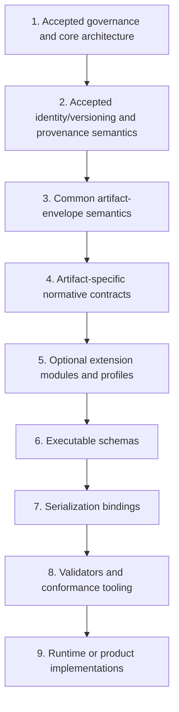
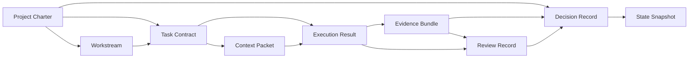

# CNTX Artifact Contract and Schema-Layering Architecture

## Status and authority

**Status: Proposed.** This contract is submitted for review under [GOVERNANCE.md](../../GOVERNANCE.md). It does not alter accepted CNTX architecture until final human approval and merge. It refines, without replacing, the accepted [core architecture contract](core-contract.md) and [contract identity and versioning contract](contract-identity-versioning.md).

Within this document, **MUST** and **MUST NOT** express mandatory requirements, **SHOULD** and **SHOULD NOT** express strong recommendations, and **MAY** expresses permission. These terms express requirement strength only within this document.

## Purpose and scope

This contract establishes the conceptual architecture and dependency direction required before individual artifact contracts or executable schemas can be designed. It applies to every canonical CNTX artifact and to future conforming artifact contracts, schemas, extensions, profiles, bindings, validators, conformance claims, and implementations.

It does not decide concrete field names; executable field-level schemas; a schema language; a serialization technology or format; validators or conformance tooling; identifier generation or registry implementation; migration tooling; runtime orchestration; API or CLI behavior; storage, transport, provider, model, or domain selection; or private implementation logic.

## Primary architecture concepts

The following table contains the single primary definition for each listed concept. These concepts MUST remain distinct and MUST NOT be conflated.

| Concept | Primary definition | Authority source | It is not |
| --- | --- | --- | --- |
| **Artifact Instance** | One concrete occurrence of a canonical CNTX artifact, governed by an artifact-specific contract and, when available, an executable schema. | Accepted artifact-specific contract | An artifact type, contract, schema, or implementation. |
| **Common Artifact Envelope** | The shared conceptual metadata boundary carried by every conforming artifact instance without defining concrete field names. | This contract, subject to accepted higher layers | An authority, approval, trust grant, or concrete data structure. |
| **Artifact-specific Contract** | The normative semantic contract for one canonical artifact type. | Accepted governance and applicable accepted architecture | An executable schema or serialization binding. |
| **Executable Schema** | A future machine-checkable structural definition that implements, but cannot replace or redefine, an accepted normative contract. | Its governing accepted normative contract | The authority source for artifact meaning or approval. |
| **Serialization Binding** | A future mapping from an executable schema to a concrete representation format. | Its governing executable schema and accepted contract | A change to accepted meaning or a storage decision. |
| **Extension Module** | An explicitly namespaced additive contract that extends a core or artifact-specific contract without overriding accepted core meaning. | Its identified governing contract and accepted extension rules | An implicit replacement for core semantics. |
| **Profile** | A declared constraint set for a specific interoperability or deployment context that may narrow optional choices but cannot weaken mandatory core requirements. | Its identified governing contract and accepted profile rules | A waiver of mandatory requirements or a universal core contract. |
| **Conformance Claim** | An evidentiary assertion that a contract, schema, artifact instance, binding, validator, or implementation satisfies explicitly identified accepted requirements and versions. | Evidence evaluated under applicable accepted requirements | Approval, authority, trust, or merge permission. |
| **Schema Family** | The organized set of related common, artifact-specific, extension, profile, and binding definitions for a declared contract/version line. | Accepted governing contracts and versioning semantics | A monolithic global schema or runtime. |

## Layer model and dependency direction

CNTX establishes this conceptual layer order:

1. accepted governance and core architecture;
2. accepted identity/versioning and provenance semantics;
3. common artifact-envelope semantics;
4. artifact-specific normative contracts;
5. optional extension modules and profiles;
6. executable schemas;
7. serialization bindings;
8. validators and conformance tooling;
9. runtime or product implementations.

Every lower layer MUST conform to applicable higher accepted layers and MUST NOT redefine their semantics. Authority-direction dependencies MUST remain acyclic. Executable schemas MUST implement accepted normative contracts rather than become their authority source; serialization bindings MUST NOT change accepted meaning; validators MUST NOT grant approval or authority; and implementations MUST NOT silently redefine contracts, schemas, provenance, privacy boundaries, lifecycle semantics, or final human authority. A mutable implementation model or generated class MUST NOT replace its governing accepted contract or schema.

## Common Artifact Envelope semantics

The Common Artifact Envelope conceptually carries the shared metadata boundary for every conforming Artifact Instance. Without selecting field names or syntax, it MUST support, as applicable, Artifact Type; Artifact Instance Identifier; Artifact Revision; governing Contract Definition Identifier and Contract Definition Version; governing Schema Identifier and Schema Version when an executable schema exists; provenance references; optional content-digest evidence; declared Extension Modules or Profiles; and references needed to resolve authoritative source relationships.

Envelope metadata does not itself grant authority, approval, trust, lifecycle state, or artifact classification. Document Status, artifact lifecycle state, approval state, and Implementation Version remain distinct concepts. Canonical classification as authoritative, evidentiary, or derived comes from the accepted core architecture and the artifact-specific contract, not from a mutable field value. Exact fields, requiredness, encoding, timestamps, ordering, and validation rules remain future schema decisions.

## Artifact-specific contract architecture

Each canonical artifact MUST receive one bounded artifact-specific normative contract before an executable schema for that artifact is introduced. Each future contract MUST define conceptually its purpose and boundaries; inherited authoritative, evidentiary, or derived classification; responsible authoring, review, approval, or derivation roles; permitted and forbidden content; required relationships; lifecycle participation; provenance and revision obligations; privacy and public-repository boundaries; extension points; deferred schema details; and evidence and review expectations appropriate to the artifact.

Artifact-specific contracts MUST NOT redefine the canonical role, artifact, authority, lifecycle, identity, versioning, provenance, or privacy semantics already accepted by higher layers.

## Canonical artifact dependency map

The minimum conceptual dependency direction is: Project Charter is the root statement of enduring intent and governance context; Workstream is governed by applicable Project Charter intent and approved scope; Task Contract is bounded by applicable Project Charter and Workstream context and records explicit authority; Context Packet is derived for an approved Task Contract and references its authoritative sources; Execution Result is produced under one Task Contract and its supplied Context Packet; Evidence Bundle supports claims about an Execution Result or other reviewable outcome; Review Record evaluates identified evidence and results within declared specialty; Decision Record records the authorized consequential decision and references applicable intent, evidence, and review; and State Snapshot is derived from integrated authoritative state and preserves provenance and uncertainty.

This map expresses conceptual dependency and traceability, not ownership, storage layout, nesting, or concrete cardinality. Derived and evidentiary artifacts MUST NOT silently replace authoritative artifacts. Cyclic authority or self-approval MUST NOT be introduced. References MUST be pinned according to the accepted identity/versioning contract where consequential traceability requires it. Exact cardinalities, optionality, embedding, and schema-level relationship rules remain deferred.

## Reference and embedding rules

Authoritative relationships SHOULD use resolvable, version- or revision-aware references rather than untracked copies. An embedded copy of authoritative content MUST be explicitly identified as a derived snapshot, preserve provenance and applicable version/revision pinning, and MUST NOT cause summaries or snapshots to silently replace authoritative sources. Private or restricted source content MUST NOT be copied into public artifacts merely to make an artifact self-contained. Exact embedding formats, dereferencing behavior, caching, offline packaging, and retention remain deferred.

## Extension and profile boundaries

Extension Modules and Profiles MUST use explicitly declared namespaces or stable identities, identify the contract and version they extend or profile, and declare compatibility and limitations. They MUST remain additive unless an accepted decision explicitly permits another relationship. They MUST NOT override core meaning, final authority, provenance, privacy boundaries, lifecycle semantics, or mandatory requirements; make private or provider-specific implementation details mandatory for the public core; or silently convert optional extension semantics into universal core requirements. Unknown-extension handling, conflict resolution, namespace syntax, profile negotiation, and extension discovery remain deferred.

## Schema-family organization

A future Schema Family conceptually organizes a common envelope definition; artifact-specific definitions; reusable shared semantic components only when duplication is proven and their authority is clear; Extension Module definitions; Profile definitions; Serialization Bindings; and future implementation conformance fixtures or tests. Reuse MUST NOT create a hidden global schema that erases artifact boundaries or forces unrelated context into every artifact. Artifact-specific schemas MUST remain independently reviewable and versioned while sharing only explicitly governed common definitions.

## Conformance and validation boundaries

Distinct conceptual conformance targets are normative-contract conformance, executable-schema conformance, Artifact Instance conformance, Serialization Binding conformance, and implementation conformance. Every Conformance Claim MUST identify the target being evaluated; governing contract and schema identifiers/versions as applicable; validation or review evidence; assumptions, limitations, and unresolved uncertainty; the claimant or responsible process; and the time or revision context when applicable.

Schema-valid does not necessarily mean contract-conformant. Validation success does not grant approval, authority, trust, or merge permission. Conformance Claims are evidentiary and MAY be incomplete or contradictory. Exact validator behavior and test suites remain deferred.

## Public/private and security boundaries

Public contracts, schemas, examples, fixtures, extensions, and conformance evidence MUST NOT expose secrets, credentials, personal data, production configuration, private paths, private project data, or domain-specific private implementation details. A schema or binding MUST NOT make private data mandatory merely because a private implementation uses it.

## Deferred decisions

This contract does not decide concrete fields and requiredness; schema language and serialization format; envelope field names and syntax; timestamps, ordering, and canonicalization; exact relationship cardinalities and embedding rules; validator behavior and error reporting; unknown-field and unknown-extension handling; extension namespace encoding and registry governance; profile negotiation and discovery; schema packaging and distribution; migration and compatibility rules by field operation; conformance fixtures and test suites; code generation; or runtime APIs, storage, transport, and orchestration. It MUST NOT preselect technologies or providers.
