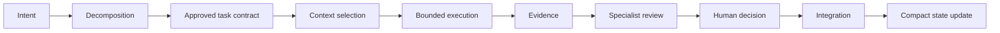

# CNTX Core Architecture Contract

## Status and authority

**Status: Accepted.** The Owner / Final Authority has granted final human approval, and this contract is accepted under [GOVERNANCE.md](../../GOVERNANCE.md). On merge and publication to `main`, it becomes the binding conceptual architecture baseline for the CNTX public core. It is subordinate to the source precedence and execution boundaries in [AGENTS.md](../../AGENTS.md) and to the authority model in [GOVERNANCE.md](../../GOVERNANCE.md). Field-level schemas and executable behavior remain future work.

Within this document, **MUST** and **MUST NOT** express mandatory requirements, **SHOULD** and **SHOULD NOT** express strong recommendations, and **MAY** expresses permission. These terms express requirement strength only within this document.

## Problem statement and central design law

Context overload is the central architectural problem. Broad, accumulated context degrades focus, reliability, reviewability, privacy, and cost control. An agent MUST NOT act simultaneously as architect, specialist, implementer, reviewer, and final approver for unrestricted consequential work. CNTX exists to divide work intelligently while preserving traceability and human authority.

The central design law is: work MUST be decomposed into bounded tasks, each task MUST receive only relevant context and explicit authority, and consequential decisions MUST remain subject to final human approval.

## Scope and non-goals

CNTX public core is a model-, vendor-, runtime-, transport-, storage-, and domain-agnostic contract layer for bounded, verifiable collaboration. It MAY support multiple human and AI collaboration patterns through future conforming layers.

This phase MUST NOT provide an executable runtime, orchestration engine, routing algorithm, prompt library, field-level data schema, validator implementation, CLI, API, provider SDK integration, domain-specific or private project logic, or autonomous approval or merge.

## Identity and versioning foundation

The [contract identity and versioning contract](contract-identity-versioning.md) defines the proposed conceptual separation of artifact identity, artifact revision, contract definition identity and version, schema identity and version, document status, implementation version, content digest, and provenance reference. Future field-level schemas MUST conform to that contract after it is accepted under applicable governance. Its proposed status does not alter this accepted baseline or grant approval.

## Canonical roles

The following are the primary definitions of CNTX canonical roles. Owner / Final Authority MUST be a human or an explicitly human-governed authority. An autonomous system or AI agent MUST NOT be the final consequential authority. Humans and systems MAY occupy multiple other operational roles, but authority separation and self-review restrictions MUST still apply to consequential decisions. A system that executes or reviews work MUST NOT make itself the final approval authority.

| Role | Primary definition |
| --- | --- |
| **Owner / Final Authority** | A human or explicitly human-governed authority that defines intent and retains final consequential approval. |
| **Lead Architect** | Decomposes work, identifies dependencies, defines contracts, and integrates reviewed results. |
| **Bounded Implementer** | Executes one explicitly authorized task within scope. |
| **Specialist Reviewer** | Reviews within a declared specialty and does not silently broaden scope. |
| **Runtime / Transport Adapter** | A future replaceable integration boundary and not a decision authority. |

## Canonical artifacts

The following are the primary definitions of CNTX canonical artifacts. In public-repository use, every artifact MUST NOT contain secrets, credentials, personal data, production configuration, private implementation data, or copied private project context.

| Artifact | Purpose | Conceptual author or approver | Classification |
| --- | --- | --- | --- |
| **Project Charter** | States enduring project intent, boundaries, and governing direction. | Owner / Final Authority authors or approves it. | Authoritative |
| **Workstream** | Groups related bounded work and its declared state. | Lead Architect establishes it; Owner / Final Authority approves consequential scope. | Authoritative |
| **Task Contract** | Authorizes one bounded task, including scope, authority, and expected evidence. | Lead Architect authors it; Owner / Final Authority or delegated authority approves it. | Authoritative |
| **Context Packet** | Supplies the minimum task-relevant source material to an executor. | Lead Architect or authorized selector prepares it; the Task Contract governs inclusion. | Derived |
| **Execution Result** | Records the bounded task's claimed output and limitations. | Bounded Implementer authors it; it is not self-approved. | Evidentiary |
| **Evidence Bundle** | Collects provenance, checks, assumptions, and limitations supporting a claim. | Bounded Implementer or Specialist Reviewer assembles it; review evaluates it. | Evidentiary |
| **Review Record** | Preserves specialist findings, uncertainty, and recommendation. | Specialist Reviewer authors it; it does not constitute final approval. | Evidentiary |
| **Decision Record** | Records an approved consequential decision and its rationale. | Authorized decision-maker approves it; Lead Architect may author it. | Authoritative |
| **State Snapshot** | Summarizes compact current state for orientation and handoff. | An authorized process or role derives it; authoritative sources remain controlling. | Derived |

## Context isolation model

CNTX defines layered context in this order:

1. project-level intent and governance;
2. workstream-level state;
3. task-level contract;
4. minimal task context packet;
5. execution evidence and review output.

Task executors MUST receive only the minimum context needed. Unrelated workstream detail MUST be excluded by default. Secrets, credentials, personal data, production configuration, and private implementation data MUST NOT be copied into public artifacts. Context inclusion MUST be justified by task relevance. Derived summaries MUST identify provenance and uncertainty. A compact state representation MUST NOT silently replace authoritative source material.

## Authority and trust model

Authority boundaries MUST be explicit and privileges MUST be limited to what the task requires. No role MAY autonomously expand scope or silently invent architecture. A Bounded Implementer MUST NOT self-approve consequential changes. Review independence MUST be appropriate to risk. Final human authority is required for architecture, security/privacy, release, and merge decisions.

Evidence does not equal approval, and discussion does not equal an accepted decision. A decision is authoritative only when it receives the approval required by applicable governance.

## Lifecycle

The conceptual lifecycle is:

`intent → decomposition → approved task contract → context selection → bounded execution → evidence → specialist review → human decision → integration → compact state update`

| Stage | Purpose | Entry condition | Exit condition | Responsible role |
| --- | --- | --- | --- | --- |
| Intent | Express the outcome and constraints sought. | A need or objective is identified. | Intent is explicit enough to assess. | Owner / Final Authority |
| Decomposition | Divide intent into bounded work and dependencies. | Intent is available. | Candidate work is bounded and related. | Lead Architect |
| Approved task contract | Authorize one task and its evidence expectations. | Scope and authority are identified. | Required approval for the task is recorded. | Lead Architect; authorized approver |
| Context selection | Prepare the minimum justified relevant context. | An approved Task Contract exists. | Context Packet is sufficient and bounded. | Lead Architect or authorized selector |
| Bounded execution | Perform the authorized task. | Task Contract and Context Packet are available. | Execution Result and initial evidence are recorded. | Bounded Implementer |
| Evidence | Assemble support for completion claims. | Execution has produced output. | Evidence Bundle states checks, provenance, assumptions, and limitations. | Bounded Implementer or Specialist Reviewer |
| Specialist review | Assess evidence and results within declared expertise. | Reviewable evidence is available. | Review Record reports findings and uncertainty. | Specialist Reviewer |
| Human decision | Apply final consequential authority. | Required review and evidence are available. | Approval, rejection, or escalation is recorded. | Owner / Final Authority |
| Integration | Incorporate an approved result into the applicable authoritative state. | A required human decision approves it. | Integrated result is traceable to decision and evidence. | Lead Architect or authorized integrator |
| Compact state update | Produce a bounded orientation summary. | Integration outcome is known. | State Snapshot identifies provenance and uncertainty. | Authorized role or process |

## Evidence and review model

Completion claims MUST be supported by evidence appropriate to the task, including as applicable a changed-path inventory, test or validation results, provenance, assumptions, limitations, security/privacy checks, and unresolved questions. Evidence MAY be incomplete or contradictory. Reviewers MUST report uncertainty. Absence of evidence is not evidence of correctness. Validation success does not authorize merge. Review findings and final decisions MUST remain separate records.

## Core invariants

1. Final consequential authority MUST remain human.
2. Every task MUST use minimal task-scoped context.
3. Scope and allowed paths or resources MUST be explicit.
4. Work MUST follow least privilege.
5. Provenance MUST be traceable.
6. Evidence MUST precede completion claims.
7. Execution, review, and approval MUST be separated appropriate to risk.
8. Scope MUST NOT expand silently.
9. Private data MUST NOT leak into public artifacts.
10. The CNTX public core MUST remain independent of models, providers/vendors, runtimes, transports, storage systems, and domains.
11. Authoritative sources MUST NOT be silently replaced by summaries.
12. Architecture changes MUST require an accepted Decision Record.

## Extension boundaries

Future replaceable extension points include model/provider adapters, runtime/execution adapters, storage adapters, transport adapters, policy modules, domain packs, and user interfaces. Extensions MUST conform to this core contract and MUST NOT redefine final authority, provenance, privacy boundaries, or core lifecycle semantics.

## Deferred decisions

This contract does not decide identifier encoding or generation; namespace registry format and governance; executable field-level schemas; lifecycle state-machine details; validation rules; trust levels and risk classes; context-packet selection algorithms; canonical serialization and storage formats; revision encoding and concurrency semantics; migration contracts and tooling; detailed compatibility rules; adapter interfaces; policy evaluation; supported-version negotiation; deprecation and retention timeframes; or conformance testing. Future work MUST NOT preselect technologies or providers without an approved decision.
