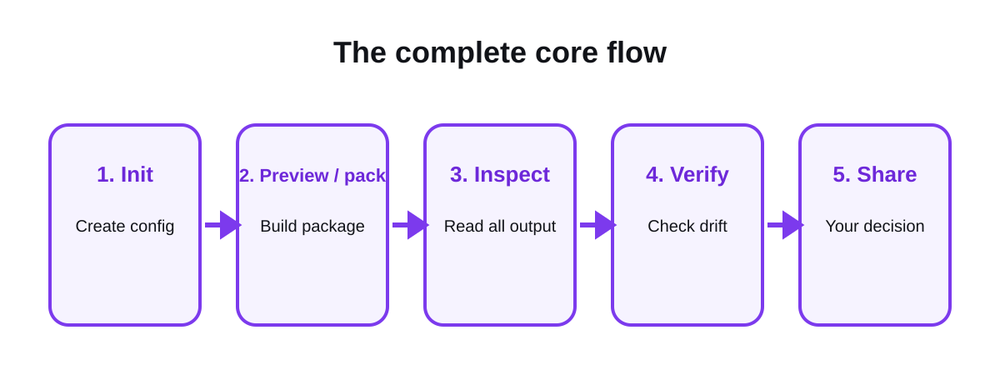

# Core commands: init, pack, and verify

The core flow creates one bounded context package from local UTF-8 text. It is
the shortest OPENCNTX path and does not require a workspace.



## 1. Create a configuration

Run inside your project directory:

```powershell
opencntx init
```

The command creates `opencntx.toml`. It fails instead of overwriting an
existing configuration.

```toml
[task]
goal = "Explain the one concrete task"

[context]
include = ["README.md", "src/**/*.py", "tests/**/*.py"]
required = ["README.md"]
exclude = [".git/**", ".opencntx/**", ".env*", "**/*.key", "**/*.pem"]
max_files = 25
max_bytes = 100000
```

### Important fields

| Field | Meaning |
|---|---|
| `goal` | One human-readable task |
| `include` | File patterns that may enter the package |
| `required` | Files that must be present |
| `exclude` | Extra patterns that must stay out |
| `max_files` | Hard file-count budget |
| `max_bytes` | Hard total-byte budget |

Built-in sensitive exclusions remain active even when your own list is short.

## 2. Build the package

```powershell
opencntx pack
```

The command:

1. validates the configuration;
2. resolves candidate paths inside the project root;
3. applies exclusions before reading content;
4. rejects binary, unreadable, unsafe, or escaping paths;
5. enforces file and byte budgets;
6. writes a complete package atomically.

The default output is `.opencntx/latest/`.

## 3. Inspect the output

Read both files:

- `CONTEXT.md` — the task goal and selected source text;
- `manifest.json` — package metadata, paths, sizes, and SHA-256 hashes.

The manifest is evidence about bytes. It is not a statement that the content
is true, complete, safe, or approved.

## 4. Verify the package

```powershell
opencntx verify .opencntx/latest
```

Verification reports source state separately:

- `unchanged` — the source exists and its recorded bytes match;
- `changed` — the source exists but its bytes differ;
- `missing` — a recorded source no longer exists;
- `unexpected` — the package contains an unrecorded file or structure.

Verification is read-only. It does not repair sources or rebuild the package.

## Exit codes

| Code | Meaning |
|---:|---|
| `0` | The requested operation completed and its checks passed |
| `1` | The request was valid but verification found drift |
| `2` | Input, configuration, path, budget, or package structure was invalid |

Treat every non-zero code as a stop until you understand the output.

## What the core does not do

- no automatic file ranking or summarization;
- no embeddings or vector search;
- no PDF, Office, image, audio, or video extraction;
- no AI, agent, network, or cloud operation;
- no automatic upload or answer verification.

## Related pages

- [Getting started](getting-started.md)
- [Context packages](context-packets.md)
- [Command reference](commands.md)
- [Security](security.md)

[Documentation home](README.md)
