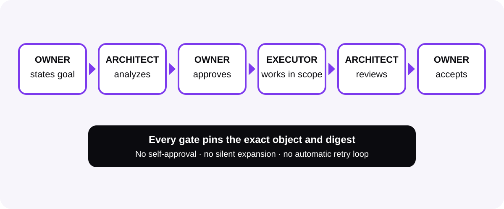

# OWNER flow

[Start here](start-here.md) · [How it works](how-it-works.md) · [Workspace](workspace.md) · [Commands](commands.md) · [Security](security.md) · [All docs](README.md)

The workspace can record one task from goal to accepted result without letting
the tool approve its own work.

<picture>
  <source media="(prefers-color-scheme: dark)" srcset="../assets/docs/owner-flow-dark.svg">
  
</picture>

## Roles in plain language

- **OWNER:** states the goal and makes the final approval and acceptance
  decisions.
- **ARCHITECT:** analyzes the project, proposes a bounded task, prepares the
  execution context, and reviews the result.
- **Bounded executor:** works only inside the approved task, playbook, role,
  and context package.

OPENCNTX records this flow. It is not itself any of these people or agents.

## Exact order

```text
OWNER goal
→ ARCHITECT analysis and proposal
→ exact OWNER proposal approval
→ task begins
→ context and executor package
→ bounded result
→ ARCHITECT review
→ exact OWNER result decision
→ task closure
```

## 1. Prepare playbook and role

Register the exact method and allowed actions. Review their definition digests.
Approve each revision separately before task execution.

Use the relevant `workspace playbook ...` and `workspace role ...` commands
from the [command reference](commands.md).

## 2. Propose one task

```powershell
opencntx workspace task propose TASK-EXAMPLE-0001 `
  --root my-project `
  --revision 1 `
  --title "Review one source" `
  --goal "Compare the source with the accepted chapter" `
  --input CONTROL/OWNER.md `
  --input CONTROL/ROADMAP.md `
  --input CONTROL/CURRENT.md
```

Add only the exact allowed inputs required by the real task. The proposal pins
their digests. A proposal is not approval.

## 3. Approve and begin separately

The OWNER approves the exact task ID, revision, and proposal digest. Only then
can the task enter `APPROVED` and subsequently `IN_EXECUTION`.

The workspace allows only one non-terminal task at a time.

## 4. Rebuild knowledge and build context

After the last official source or chapter change:

```powershell
opencntx workspace catalog rebuild --root my-project
```

Build task context only when all required chapters are technically `CURRENT`
and content-approved for the task.

## 5. Verify live context before the result

While the task is still `IN_EXECUTION`:

1. verify the task-bound context;
2. verify the executor package;
3. inspect the assignment and permitted actions;
4. only then submit the bounded result.

This order avoids treating an old snapshot as live authority.

## 6. Result and review

The executor submits one result object and separate evidence. The ARCHITECT
reviews the exact result digest and records `PASS`, `FAIL`, or the defined
review outcome without accepting on behalf of the OWNER.

## 7. OWNER decision and closure

The OWNER accepts, returns, or rejects the exact result and review objects.
Closure is allowed only after the required accepted decision.

After closure, verify the append-only task chain, result, evidence, and executor
status as historical proof. Do not expect live `IN_EXECUTION` context status.

## Fail-closed and anti-deadloop behavior

- A wrong digest, state, revision, or input stops the operation.
- One failed attempt records one stable signature.
- OPENCNTX does not retry automatically.
- After three equal failure signatures, the task becomes visibly `BLOCKED`.
- Further work requires a new human decision, not a silent loop.

## Related pages

- [Playbooks and roles](playbooks-and-roles.md)
- [Context navigation](context-navigation.md)
- [Chapters and catalog](chapters-and-catalog.md)
- [Security](security.md)

[Documentation home](README.md)
