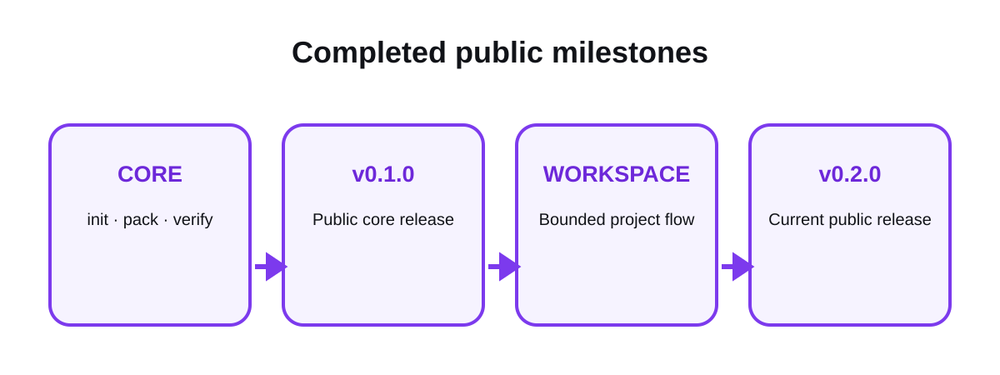

# Public roadmap

This page reports completed public facts. It does not promise unapproved
features or expose private project records.

## Completed foundation

### Reset and small runnable core

- established the OPENCNTX project and provider-neutral boundary;
- added `init`, `pack`, and `verify`;
- proved the core flow on Windows and Ubuntu.

### Public v0.1.0

- released the deterministic three-command context package flow;
- documented explicit includes, exclusions, budgets, hashes, and drift;
- kept AI, network, cloud, GUI, and provider integrations out of scope.

### Workspace foundation

- byte-exact source capture and receipts;
- chapter revisions and replaceable local catalog;
- append-only tasks with separate OWNER gates;
- deterministic task-bound context navigation;
- safe registration of already derived UTF-8 text;
- proposed and approved playbooks and roles;
- bounded executor packages that do not start execution;
- compact current control snapshot for large roadmaps.

### Public v0.2.0

- released the complete current workspace foundation;
- activated six-job Windows and Ubuntu CI;
- added strict `main` protection and immutable release evidence;
- published security, community, documentation, and brand surfaces.

## Current state

- Current release: `v0.2.0`
- Package version: `0.2.0`
- Runtime dependencies: none
- CI: `CI_ACTIVE`
- Product focus: local, explicit, bounded, verifiable context

## Future work

No future feature is promised by this page. A next item becomes active only
after a separate bounded proposal, explicit OWNER approval, implementation,
tests, review, and merge.

Ideas are evaluated against the product boundary. AI calls, automatic agents,
cloud synchronization, OCR, transcription, embeddings, databases, GUI, MCP,
or other expansion are not implied roadmap commitments.

## Related pages

- [How it works](how-it-works.md)
- [Platforms](platforms.md)
- [Changelog](../CHANGELOG.md)
- [Contribution guide](../CONTRIBUTING.md)

[Documentation home](README.md)
