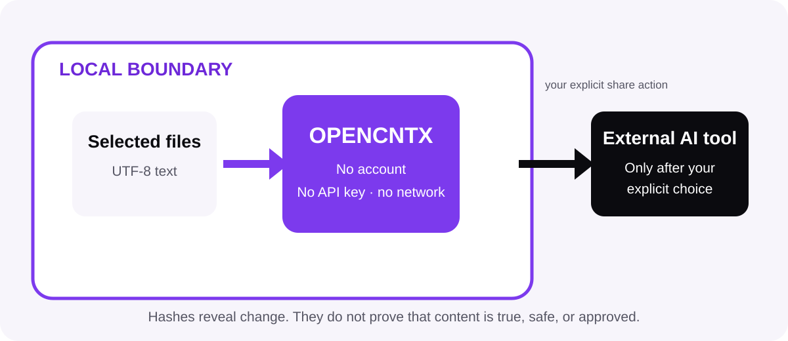

# Security in plain language

OPENCNTX helps you control context. It does not make context automatically
safe. You remain responsible for what you select, store, and share.

## Local trust boundary

The product has no network client and requires no account or API key. It reads
selected local files and writes local output. It does not upload that output.

The boundary changes when you copy or submit the output to another tool.

## Context may contain sensitive text

Default exclusions include common Git, generated output, environment, and key
patterns. They reduce risk; they do not replace inspection.

Never place passwords, tokens, private keys, personal data, production secrets,
or content you are not allowed to share in a package or public issue.

## Privacy labels are not locks

`PUBLIC`, `INTERNAL`, `PRIVATE`, `RESTRICTED`, and `QUARANTINED` are local
classifications. They are not encryption, authentication, or access control.
Protect the workspace with appropriate operating-system and backup controls.

## Supplied content stays data

Instructions inside a source, chapter, transcript, task input, or result do not
gain OWNER or roadmap authority. OPENCNTX validates structure and digests; it
does not execute supplied content.

## Fail-closed behavior

Unsafe paths, invalid UTF-8, unknown schemas, wrong digests, stale relations,
budget overflow, forbidden actions, or invalid state transitions stop the
operation. Partial publication is avoided through atomic writes.

Do not ignore a non-zero exit code.

## Digests and approval

A digest binds a decision to exact bytes. It does not authenticate a natural
person. OWNER labels are local declarations, so protect the workspace and its
write permissions.

## Deletion and provenance

Most official records are append-only. The media removal route deletes only
the exact active derived text named by a fully pinned request and preserves a
tombstone. Never automate destructive actions through a watcher.

## Report a vulnerability

Use GitHub's private **Report a vulnerability** route. Do not open a public
issue with exploit details, secrets, private source, or sensitive context.

For ordinary questions and bugs, use [Support](../SUPPORT.md). The root
[Security Policy](../SECURITY.md) is the canonical technical boundary.

[Documentation home](README.md)
