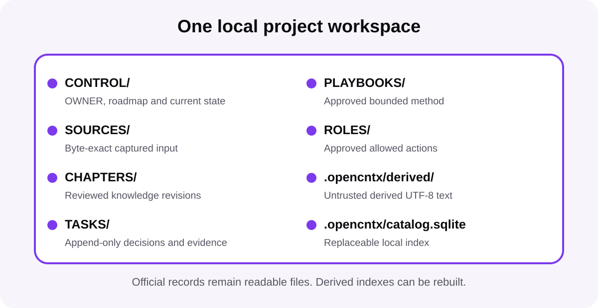

# Advanced / Alpha workspace

[Start here](start-here.md) · [How it works](how-it-works.md) · [Advanced / Alpha workspace](workspace.md) · [Commands](commands.md) · [Security](security.md) · [All docs](README.md)

The optional workspace layer is an **Advanced / Alpha** feature for longer
projects. It is not required for the core `init → preview → pack → inspect →
verify` route, and its Alpha surfaces may still evolve. It organizes work
without turning OPENCNTX into a cloud service, AI platform, or automatic agent
system.

<picture>
  <source media="(prefers-color-scheme: dark)" srcset="../assets/docs/workspace-map-dark.svg">
  
</picture>

## Create a workspace

```powershell
opencntx workspace init my-project
```

The command creates a new directory and refuses to overwrite a non-empty one.
Use `--force-empty-existing` only for an existing directory that is truly
empty.

```text
my-project/
├── opencntx.toml
├── CONTROL/
│   ├── OWNER.md
│   ├── ROADMAP.md
│   └── CURRENT.md
├── SOURCES/
├── CHAPTERS/
├── TASKS/
├── PLAYBOOKS/
├── ROLES/
└── .opencntx/
```

## Refresh the compact control snapshot

A new workspace includes one marked current block in `CONTROL/ROADMAP.md`.
After editing that official block, run:

```powershell
opencntx workspace control refresh --root my-project
```

This creates or refreshes `.opencntx/control-snapshot.md`. The full roadmap
digest remains pinned. OPENCNTX does not write roadmap decisions or summarize
them with AI.

## Capture one supplied source

```powershell
opencntx workspace capture README.md `
  --root my-project `
  --origin OWNER `
  --privacy PRIVATE
```

The capture flow:

- reads one regular local file;
- rejects directories, devices, symlinks, and managed internal paths;
- stores exact bytes under a generated source ID;
- records origin, privacy label, size, and SHA-256;
- omits the original absolute path from the official record;
- returns a receipt.

New sources default to `PRIVATE`. Labels are classification, not encryption.

## What comes next

Captured sources do not automatically become accepted knowledge or task
context. The normal order is:

1. capture a source;
2. create and review a chapter;
3. rebuild the catalog;
4. register and approve any needed playbook and role;
5. propose and approve one task;
6. build and verify task context;
7. prepare at most one bounded executor package;
8. submit, review, accept, and close the result.

## Storage boundaries

- Original sources stay separate from derived text.
- Official records stay separate from replaceable indexes.
- Append-only task events are never treated as editable status files.
- A source hash does not grant OWNER approval.
- No workspace command starts an AI, agent, OCR tool, or external sync.

## Related pages

- [Chapters and catalog](chapters-and-catalog.md)
- [Context navigation](context-navigation.md)
- [Media and derived text](media.md)
- [OWNER flow](owner-flow.md)
- [Security](security.md)

[Documentation home](README.md)
